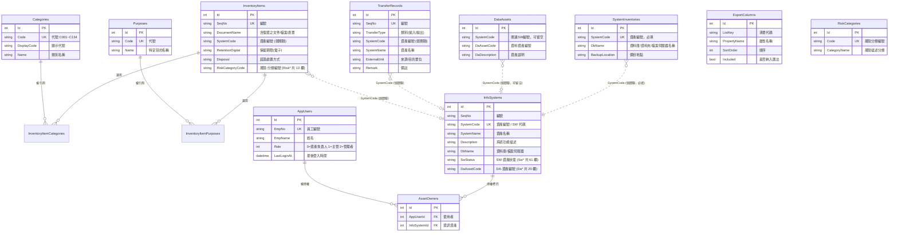

# 個資盤點管理系統 (PdInventory) — 架構文件

> 本文件由原始碼分析產出，說明系統的整體架構、模組職責、資料模型與資料表關聯。
>
> 另見 [欄位選項化盤點](欄位選項化盤點.md)：六張清單逐欄統計，列出哪些自由文字欄位
> 應改為下拉或複選、哪些要先正規化，以及兩個應該自動計算的欄位。

---

## 1. 系統概觀

PdInventory 是一套取代人工維護「個資清冊.xlsx」的 Web 系統，將原 Excel 各工作表（Sheet1～Sheet3、附表一、附表二、風險自評相關表）與外部資訊資產清單（軟體 SW／資料 DA）數位化，提供 CRUD、關鍵字搜尋、欄位排序、Excel 匯出與資料正規化。

| 項目 | 內容 |
|------|------|
| 應用框架 | ASP.NET Core MVC（.NET 10） |
| ORM | Entity Framework Core 10（**使用 Migrations**） |
| 資料庫 | SQLite（`App_Data/pdinventory.db`） |
| 前端 | Bootstrap 5.3.3、jQuery、jQuery Validation |
| 匯出 | ClosedXML（.xlsx） |
| 語言特性 | Nullable enable、ImplicitUsings enable |

### 啟動流程

1. `Program.cs` 建立 `WebApplication`，註冊 MVC、`AppDbContext`（SQLite）、**Session**（清單頁搜尋記憶用，30 分鐘閒置逾時）、**Cookie 驗證**與**授權原則**。
2. `InfoSystemBlocks.AssertViewModelsCoverAllFields()` 檢查編輯畫面的 ViewModel 是否與 `InfoSystem` 的欄位同步，不一致直接擲出例外。
3. `DbSeeder.Seed` 先呼叫 `db.Database.Migrate()` 建立／升級結構，再匯入 `Data/Seed/*.json` 種子資料（僅在對應資料表為空時匯入），最後在 `AppUsers` 為空時建立初始使用者。
4. HTTP 管線：例外處理 → HSTS → HTTPS 轉址 → 路由 → **Session** → **驗證** → 授權 → 靜態資產。
5. 預設路由 `{controller=Home}/{action=Index}/{id?}`。

> **結構異動一律走 Migrations。** 早期版本使用 `EnsureCreated()`，但它不會替既有資料庫補上後來新增的資料表；現行資料庫已以 `InitialCreate` 建立基準點。新增欄位或資料表請執行：
> ```
> dotnet tool run dotnet-ef -- migrations add <名稱> --project PdInventory/PdInventory.csproj
> ```
> 工具版本定義於 repo 根目錄的 `.config/dotnet-tools.json`。

---

## 2. 分層架構

- **表現層 (Views)**：Razor 檢視。`_Layout.cshtml` 提供頂部標題列與可收合的左側導覽清單；`Views/Shared/` 另有跨控制器共用的 `CreateAll`／`EditAll`。
- **控制層 (Controllers)**：16 個控制器。
- **輔助層 (Helpers)**：跨控制器的共用邏輯，含身分（`ICurrentUser`／`IEmployeeDirectory`）與授權（`IAssetAccess`／`Policies`）。
- **資料存取層 (Data)**：`AppDbContext`、`DbSeeder`、`Migrations/`。
- **模型層 (Models)**：`Entities.cs` 內 14 個實體，含中文 `Display` 標籤與驗證屬性；`Models/ViewModels/` 為畫面專用模型。
- **持久層**：SQLite 單一檔案資料庫。

### 2.1 架構圖


---

## 3. 控制器與功能對應

### 3.1 主表（六張清單）

| 控制器 | 來源對應 | 路徑 | 動作 |
|--------|---------|------|------|
| `SoftwareController` | 資訊資產清單－軟體(SW) | `/Software` | Index / **Details** / Edit(POST) / Delete / Export |
| `DataController` | 資訊資產清單－資料(DA) | `/Data` | Index / Edit(POST) / Delete / Export |
| `SystemsController` | Sheet3 資訊系統盤點表 | `/Systems` | Index / **Create** / **Edit** / Delete / Export |
| `InventoryController` | Sheet1 個人資料檔案盤點表 | `/Inventory` | Index / Details / Create / Edit / Delete / Export |
| `RiskController` | 個人資料安全風險自評表 | `/Risk` | Index / Details / Create / Edit / Delete / Export |
| `TransfersController` | Sheet2 系統自動拋轉清單 | `/Transfers` | Index / **Details** / Create / Edit / Delete / Export |

### 3.2 維護資料（下拉選項來源）

| 控制器 | 所屬表單 | 對應 | 路徑 |
|--------|---------|------|------|
| `CategoriesController` | 個資盤點表 | 附表一 個人資料類別 | `/Categories` |
| `PurposesController` | 個資盤點表 | 附表二 特定目的列表 | `/Purposes` |
| `RiskCategoriesController` | 風險自評表 | 3-1 風險分類編號 | `/RiskCategories` |
| `RiskImpactsController` | 風險自評表 | 3-2 評估影響程度 | `/RiskImpacts` |
| `RiskLikelihoodsController` | 風險自評表 | 3-3 評估發生可能性 | `/RiskLikelihoods` |
| `RiskEffectivenessController` | 風險自評表 | 3-4 有效性評估 | `/RiskEffectiveness` |
| `DepartmentsController` | **共用** | 部門（利潤中心＋部門） | `/Departments` |
| `OpsStaffController` | **共用** | 資管維運（組別＋姓名） | `/OpsStaff` |

`Categories`／`Purposes`／`RiskCategories` 具代號唯一性驗證，且被引用時禁止刪除。

**側邊欄的三層結構**（`Helpers/MaintenanceCatalog.cs`）：
維護資料 → 六張表單（外加「共用」）→ 各表單的維護項目。
之後還會有很多欄位改成可維護的選單，屆時只要在 `MaintenanceCatalog.Groups`
對應的群組裡加一行，側邊欄就會自己長出來，不必再動 `_Layout.cshtml`。
「共用」放的是不專屬於任何一張表單的選單——人員、部門這種六張表都會用到的，
目前還沒有項目，畫面上顯示「尚無維護項目」。

第二層用原生的 `<details>`／`<summary>`，收合不必寫 JavaScript；
**目前所在頁面的那一組由伺服器端直接加上 `open`**，換頁時不會先展開再收起來。
群組的展開狀態不跨頁記憶——每次導覽都會落在某個群組裡，該開的那一組本來就會開著。

### 3.3 其他

| 控制器 | 說明 |
|--------|------|
| `HomeController` | 首頁：12 張卡片，顯示各表筆數 |
| `ExportSettingsController` | 匯出欄位維護：拖曳排序、勾選是否納入、還原預設（限管理者） |
| `AccountController` | 登入／登出（`[AllowAnonymous]`） |
| `PermissionsController` | 權限設定：調整使用者角色與資產授權（限管理者） |

### 3.4 SW / DA / 系統盤點三者的共用畫面

三個控制器操作**同一張 `InfoSystems` 資料表**的不同欄位群組，因此檢視與新增／編輯畫面是共用的：

| 畫面 | 位置 | 提供者 |
|------|------|--------|
| 檢視 | `Views/Software/Details.cshtml` | `SoftwareController.Details`（SW 為主表） |
| 新增 | `Views/Shared/CreateAll.cshtml` | `SystemsController.Create` |
| 編輯 | `Views/Shared/EditAll.cshtml` | `SystemsController.Edit` |

**三者已各自獨立成表**（`InfoSystems`／`DataAssets`／`SystemInventories`），以 `SystemCode` 弱關聯。
統一畫面只是把「同一套系統的三份資料」放在一起呈現，不再代表它們是同一列。

- **編輯**：三個區塊各是獨立 `<form>`，分別 POST 到 `Software/Edit`、`Data/Edit`、`Systems/Edit`，各自繫結自己的 ViewModel（`SoftwareEditViewModel`／`DataEditViewModel`／`SystemEditViewModel`），欄位名稱以 `Software.`／`Data.`／`Sheet3.` 前綴區隔，因此送出的內容只可能屬於該區塊，三個 `<form>` 也不會產生重複的 DOM id。
  路由的 `id` 一律是 **InfoSystems 的主鍵**（用來定位與判權限），DA 與盤點表自己的主鍵放在各區塊的 `Id` 欄位；為 0 表示這套系統還沒有那份資料，存檔時會建一列。
- **新增**：只有一個送出按鈕。三個區塊一起送出，SW 必建，DA 與盤點表則只在真的有填內容時才建立。
- **共用識別欄位**（編號／資產編號／資產名稱／資產說明）屬於 `InfoSystem`，在 SW 區塊維護。
- ⚠ **沒有 SW 關聯的資料資產**（各組的 PC／NB）不會出現在這個畫面上，只能從 DA 清單維護。
  目前 DA 清單尚未提供獨立的新增／編輯表單，這是下一輪畫面調整要補的。
- **來源判斷**：清單頁的連結帶 `from`，`ListSource` 比對白名單後決定[取消]／[回列表]回到哪一張清單；`from` 也隨表單 POST 帶回，存檔導回本頁時不會遺失。

---

## 4. 跨控制器共用邏輯（Helpers）

| 類別 | 職責 |
|------|------|
| `SearchMemory` | 清單頁搜尋條件的 Session 記憶。**六張主表共用同一格**，因為 SW-XXX 是各表都有的欄位，可用它串連不同表單 |
| `ListSource` | 將網址上的 `from` 比對白名單（Software／Data／Systems），決定返回哪一張清單 |
| `ExportCatalog` | 各清單可匯出的欄位集合，並與 `ExportColumns` 設定合併出實際順序 |
| `ExcelExporter` | 依設定的欄位順序產生 .xlsx（ClosedXML） |
| `InfoSystemBlocks` | SW／DA／系統盤點三個編輯區塊與各自實體之間的欄位搬移 |
| `ICurrentUser` | 目前操作者（員工編號、姓名、角色），軌跡與授權判斷的來源 |
| `IEmployeeDirectory` | 身分來源，`Remote`／`Simulated` 兩種實作可切換 |
| `IAssetAccess` | 單筆資料的修改權限判斷 |
| `Policies` | 授權原則名稱常數 |
| `RoleDisplay` | 角色的中文名稱與說明 |
| `AssetPicker` | 資產編號下拉的選項，以及依編號查出資產名稱 |
| `FieldOptions` | 值固定、不隨組織異動的欄位選項（是／否、資產狀態、等級…） |

### 4.1 搜尋條件記憶

- **儲存**：按[搜尋]時存搜尋欄文字；點[檢視]／[編輯]時存該筆的資產編號。
- **清除**：[清除]／[取消]／[回列表] 的連結一律帶 `clear`。
- **使用**：直接進入清單頁（網址沒有 `q`）時帶出記憶值並套用篩選。

> `clear` 與 `q` 都以「網址有沒有這個參數」判斷，不用 action 參數：`bool` 參數只接受 `true`/`false`，`clear=1` 會綁不進來而靜默失效。

### 4.2 匯出欄位

- 欄位群組以**屬性名稱前綴**推導而非寫死清單：Software = 基本欄位 + `Sw*`、Data = 基本欄位 + `Da*`、Systems = 其餘（Sheet3）欄位；其他清單為該實體全部欄位。
- `ExportColumns` 只存屬性名稱與順序、**不存標題**，標題一律取自模型的 `[Display]`，維持單一來源。
- 合併時以模型為準：設定裡已不存在的屬性忽略、模型新增的補到最後，欄位增刪不會讓既有設定失效。

---

## 5. 資料模型

| 實體 | 資料表 | 說明 |
|------|--------|------|
| `PdCategory` | `Categories` | 附表一：個人資料類別（`C001`～`C134`） |
| `Purpose` | `Purposes` | 附表二：特定目的 |
| `InventoryItem` | `InventoryItems` | Sheet1 個資檔案盤點 **＋ 風險自評欄位**（`Risk*`） |
| `TransferRecord` | `TransferRecords` | Sheet2：系統自動拋轉清單 |
| `InfoSystem` | `InfoSystems` | 軟體(SW)資產（73 欄）：SW 欄位 ＋ 共用識別 ＋ 與 DA 合併的 9 個共用欄位 |
| `DataAsset` | `DataAssets` | 資料(DA)資產。`SystemCode` **可留空**——終端設備類的資料資產沒有對應的 SW |
| `SystemInventory` | `SystemInventories` | 資訊系統／資料庫／檔案伺服器盤點表。`SystemCode` 必填 |
| `RiskCategory` | `RiskCategories` | 3-1：風險分類編號 |
| `RiskImpactLevel` | `RiskImpactLevels` | 3-2：評估影響程度 |
| `RiskLikelihoodLevel` | `RiskLikelihoodLevels` | 3-3：評估發生可能性 |
| `RiskEffectivenessLevel` | `RiskEffectivenessLevels` | 3-4：有效性評估 |
| `ExportColumn` | `ExportColumns` | 各清單匯出欄位的順序與是否納入 |
| `AppUser` | `AppUsers` | 系統使用者：員工編號、姓名、角色、最後登入時間 |
| `AssetOwner` | `AssetOwners` | 資產授權：某位使用者負責某個資訊資產 |

### 關聯與約束 (`AppDbContext.OnModelCreating`)

- `PdCategory.Code`、`Purpose.Code`、`RiskCategory.Code`、三個風險等級的 `Level` 建立唯一索引。
- `ExportColumn` 以 (`ListKey`, `PropertyName`) 唯一。
- `InventoryItem` ⟷ `PdCategory`：多對多，中介表 `InventoryItemCategories`。
- `InventoryItem` ⟷ `Purpose`：多對多，中介表 `InventoryItemPurposes`。
- **主檔識別欄位唯一**（`AddUniqueKeyIndexes`）：`InfoSystems.SystemCode`、`InventoryItems.SeqNo`、`TransferRecords.SeqNo`，皆以 `HasFilter` 排除空字串（SQLite 視空字串為相等值，未填代碼的資料會互撞）。
  `DaAssetCode` **刻意不設唯一** —— 來源資料本來就允許一筆 DA 對應多個 SW（DA-049 同時對應 SW-048 與 SW-049）。
- `AppUser.EmpNo` 唯一；`AssetOwner` 以 (`AppUserId`, `InfoSystemId`) 唯一，兩個外鍵皆為 Cascade。
- `AssetOwner` 有查詢篩選 `!a.InfoSystem.IsDeleted`，授權跟著資產走，資產被軟刪除後授權不再出現。

### 5.1 資料正規化

原 Excel「使用資料(欄位)」「特定目的」為手動輸入文字，寫法混亂（如 `COO三`、`C00三`、`Ｃ○○三`）。系統改為多對多關聯，匯入時正規化為標準代號。維護檔項目若仍被盤點項目引用，刪除會被擋下。

### 5.2 弱關聯 (Soft Reference)

以下為透過欄位值配對、**未在資料庫層建立外鍵**的邏輯關聯：

- `DataAsset.SystemCode` ↔ `InfoSystem.SystemCode`（**可留空**）
- `SystemInventory.SystemCode` ↔ `InfoSystem.SystemCode`（必填）
- `InventoryItem.SystemCode` ↔ `InfoSystem.SystemCode`
- `TransferRecord.SystemCode` ↔ `InfoSystem.SystemCode`
- `InfoSystem.DaAssetCode`：資料資產編號，一筆 DA 可對應多筆 SW

前兩者雖然沒有外鍵，但畫面上**已改為從資訊資產清單挑選**（`Helpers/AssetPicker.cs`），
個資盤點、風險自評、拋轉清單的新增與編輯都不再是自由輸入，打錯編號造成關聯斷裂的機會因此消失。
資產名稱一律由伺服器端依編號查出後寫入，不採信畫面送回來的值。

編號已不在清單中的舊資料（例如該資產後來被刪除）仍會保留：下拉會多出一個
標示「已不在資產清單中」的選項並選中它，不會因為選不到而在存檔時被清成空白。

### 5.3 合併欄位盤點（重新匯入前必看）

多張來源試算表寫進同一張資料表時，若兩張表的某個欄位被塞進**同一個實體屬性**，
後匯入的那份會蓋掉先匯入的，而且畫面上看不出來。以下是逐欄查核後的結果。

> **DA 與盤點表已於 `SplitDataAssetsAndInventories` 各自獨立成表**，
> 因此它們自己的欄位不再有互相覆蓋的問題。本節仍然重要的是兩點：
> 一是 `InfoSystems` 上那些由多張來源表共同寫入的欄位；
> 二是 DA 來源檔仍然帶著 9 個已合併到 SW 的欄位，**匯入時必須略過**。

**InfoSystems（來源：SW 表、第 6 表系統盤點；DA 表以「關連SW編號」比對）**

SW 與 DA 兩張表有 14 個同名欄位，其中 12 個在實體裡各有獨立屬性（`SwStatus`／`DaStatus`、
`SwRiskOwner`／`DaRiskOwner`、`SwOwnerUnit`／`DaOwnerUnit`…），互不干擾。真正共用的是：

| 實體屬性 | 由誰寫入 | 說明 |
|----------|----------|------|
| `SystemCode` | SW 表「資產編號」、第 6 表「資產編號」；DA 表以「關連SW編號」比對 | 跨表關聯鍵，設計如此 |
| `SystemName` | SW 表「軟體資產名稱」、第 6 表「軟體資產名稱」 | 同名同義，衝突風險低 |
| `SeqNo` | 第 6 表「編號」 | 單一來源 |
| `Description` | **SW 表與第 6 表共用的資產說明**，內容取自 SW 表 | 已定案 |
| `DataAsset.DaDescription` | **DA 表自己的資產說明**，內容取自 DA 表（已在獨立的資料表上） | 已定案 |

**資產說明的歸屬已定案**（業務端決議）：SW 與第 6 表視為同一個欄位，DA 自己一個欄位。

- `Description`（標題「資產說明」）＝ SW 與第 6 表共用，內容一律取自 SW 表。
  第 6 表原本的「系統功能描述」是操作層級的長文（「使用部門: … 主要功能: 1. … 2. …」），
  與 SW 的一句話資產說明性質不同，26 筆重疊中只有 3 筆相同；依決議已全數改用 SW 的版本。
- `DaDescription`（標題「DA-資產說明」）＝ DA 表自己的，內容取自 DA 表。
  DA 表只涵蓋 29 個編號，未涵蓋的 SW-048、049、075、154、167 依決議沿用 SW 的文字，不留空白。

因此**重新匯入時**：SW 表的資產說明寫入 `Description`，DA 表的寫入 `DaDescription`，
第 6 表的「系統功能描述」不再寫入資料庫（已由 SW 的版本取代）。

**SW 與 DA 已刻意合併的 9 個欄位**

下列欄位原本 SW 與 DA 各有一份，但記錄的是同一個資產的同一件事，已合併為 SW 那一份
（`Da*` 屬性已移除，見 `MergeSharedSwDaFields`）。
**DA 的來源試算表至今仍然帶著這 9 欄，每次匯入都必須略過**，否則會蓋掉 SW 的值：

| 合併後的屬性 | 原本的 DA 屬性 | 合併時捨棄的 DA 值 |
|--------------|---------------|-------------------|
| `SwStatus` | `DaStatus` | 0 筆（完全相同） |
| `SwOwnerUnit` | `DaOwnerUnit` | 0 筆 |
| `SwCustodianUnit` | `DaCustodianUnit` | 0 筆 |
| `SwRiskOwner` | `DaRiskOwner` | 0 筆 |
| `SwConfidentiality` | `DaConfidentiality` | 3 筆 |
| `SwIntegrity` | `DaIntegrity` | 6 筆 |
| `SwAvailability` | `DaAvailability` | 10 筆 |
| `SwLocation` | `DaLocation` | 12 筆（另 18 筆只是分隔符號寫法不同） |
| `SwAssetValue` | `DaAssetValue` | 13 筆（皆因上述三個等級不同而連帶不同） |

這 9 個欄位只由 **SW 區塊**維護，DA 的清單、檢視與匯出照常顯示但不可編輯。

> **重新匯入 DA 來源檔時必須略過這 9 欄。** 那份試算表仍然有這些欄位，
> 直接匯入會把 SW 的值蓋掉——與資產說明是同一類問題。

`SwAssetValue` 另外改為由 `AppDbContext.RecalculateAssetValues` 自動計算
（＝機密性＋完整性＋可用性），畫面上唯讀。

**InventoryItems（來源：第 3 表風險自評、第 4 表個資盤點）**

分得乾淨：13 個 `Risk*` 屬性來自第 3 表，其餘 31 個來自第 4 表，
連容易撞名的「編號」與「備註」都各有各的（`RiskDataSeqNo`／`SeqNo`、`RiskRemark`／`Remark`）。

唯一的例外是 `SeqNo`／`SystemCode`／`DocumentName`：正常由第 4 表寫入，
但當初有 3 筆風險自評在第 4 表找不到對應（編號 19、20、21），改由第 3 表寫入這三個欄位。
重新匯入第 4 表時，這 3 筆不會被涵蓋。

**TransferRecords（來源：第 5 表）**

單一來源，沒有合併欄位。不過「類別」原本有 `拋出/拋入`、`拋入/拋出` 這種
**一格塞兩件事**的寫法（共 4 筆）。2026-09-03 業務端確認一筆只會是單向，
已各拆成兩筆，除類別外欄位完全相同，新那筆的編號是 `原編號-1`
（編號有唯一索引，不能同號；用後綴才留得住來源並在排序時緊接原筆）。
拆完 51 筆變 55 筆，選項也只留「拋入／拋出」。

### 5.4 欄位選項化

值固定的欄位已由自由輸入改為下拉，選項集中在 `Helpers/FieldOptions.cs`：

| 清單 | 欄位數 | 內容 |
|------|-------|------|
| 資訊資產清單-軟體(SW) | 23 | 11 個是／否型 ＋ 12 個固定分類（資產狀態、系統類別、機密性／完整性／可用性 1~4、RTO／RPO…） |
| 資訊資產清單-資料(DA) | 1 | 資產類別 |
| 個資檔案盤點表-人為產出 | 5 | 個資當事人類別、符合個資法§6條件、公司角色、對外傳遞方式、期限屆滿後處置方式 |
| 系統自動拋轉清單 | 1 | 類別（只有拋入／拋出） |

與「維護資料」表的分工：單位、人員、地點那類**會隨組織變動**的選項要進資料表，
由管理者自行維護；`FieldOptions` 只放本質上不會變的（是／否、線上／下線、等級 1~5）。

**來自維護資料表的選項**走另一條路：`Helpers/LookupOptions.cs`（Scoped 服務，
`_ViewImports` 已 `@inject`，畫面直接用 `Lookup.Departments`）。做成注入而不是每個
控制器塞 ViewBag，是因為這類欄位會愈來愈多，四、五個畫面各補一次很快就會漏掉一個。

| 欄位 | 來源 | 型式 |
|------|------|------|
| SW-業務權責單位 | 部門 | 單選 |
| SW-使用者帳號權限授與 | 部門 | 多選 |
| SW-使用單位 | 部門 | 多選 |
| SW-維運人員 | 資管維運 | 多選 |
| SW-程式換版人員 | 資管維運 | 多選 |
| 拋轉清單-負責內部單位 | 部門 | 單選 |

**多選欄位怎麼存**：欄位在資料庫仍然是一格文字、以 `/` 分隔（來源 Excel 本來就這樣寫），
畫面用 `_MultiCheckList.cshtml` 的勾選清單，勾選由 `site.js` 同步進一個 hidden input。
控制器與 ViewModel 完全不必更動，之後要把別的欄位改成多選只要在畫面換一行。

切開字串的規則集中在 `Helpers/MultiValue.cs`，畫面與後端統計共用同一套，有兩個地雷：
括號裡的斜線不是分隔符（`總公司各單位(作業中心/國際法人部)` 是一個值），
以及 `N/A` 是一個完整的答案、不是 N 跟 A。

> 沒有動過的多選欄位不會重寫 hidden 的值，因此不碰它就不會有任何變化；
> 一旦動過，順序會照維護資料表的順序重排。

> 改成下拉最容易踩的坑是**既有值不在選項中**——`<select>` 會顯示空白，
> 使用者一按儲存就把原本的資料清掉，而且畫面上完全看不出來。
> 因此 `FieldOptions.ItemsFor` 會在目前值不在選項中時額外插入一個標示過的選項並保留原值。
> 導入這 29 個欄位前也逐欄比對過，確認選項涵蓋資料庫現有的每一個值。

**資產價值與系統類別的連動**（`site.js`）：機密性／完整性／可用性一改就即時重算資產價值；
**超過** 10 時顯示提醒（剛好等於 10 不算），送出時若系統類別不是「核心系統」
則跳出阻擋視窗並提供一鍵修正。**這條規則已由業務端於 2026-09-03 確認。**

0902 匯入後的 55 筆：資產價值 > 10 的 19 筆全部是核心系統，規則零例外
（核心系統從 8 筆增為 24 筆就是這麼來的）。另有 5 筆資產價值 ≤ 10 卻標成核心系統
（SW-016、017、024、026、117），這不違反規則——業務端定的是「> 10 就必須是核心系統」，
反向並未禁止，因此保留來源檔的標註，畫面也不會擋。

> 這兩層都在瀏覽器端，屬於操作防呆；要真正強制得在控制器加伺服器端檢核。

其餘欄位的盤點結果（哪些該做成維護資料、哪些要先正規化）見
[欄位選項化盤點](欄位選項化盤點.md)。

### 5.5 以程式直接寫入資料庫時的注意事項

歷次匯入都是以腳本直接對 SQLite 下 SQL，不經過 EF。這樣做要留意兩個欄位的格式，
寫錯不會有任何錯誤訊息，但畫面會壞掉：

- **`RowVersion` 必須是大寫**。EF（Microsoft.Data.Sqlite）把 Guid 存成
  `A239140D-12F2-4E21-A961-8AE1D5C2D059` 這種**大寫**文字，而 SQLite 的 `=`
  對文字大小寫敏感。若腳本寫入小寫，並行控制的 `WHERE RowVersion = @p` 永遠不成立，
  那些資料列**從此在畫面上存不了檔**，而且只會看到「這筆資料已被其他人修改」的訊息，
  完全看不出真正的原因。0821 匯入曾經踩過這個坑，33 筆全中。
- **`UpdatedBy` 要填得出是誰做的**，匯入請用可辨識的字串（例如 `(SW 匯入 0821)`），
  不要留空或沿用他人帳號。

匯入後可以用這段檢查：

```sql
SELECT COUNT(*) FROM InfoSystems WHERE RowVersion <> upper(RowVersion);  -- 應為 0
```

---

## 6. 資料表關聯圖



---

## 7. 畫面樣式慣例

版面樣式集中在 `wwwroot/css/site.css`，三個類別即涵蓋全站：

| 類別 | 用途 |
|------|------|
| `.pd-table` | 清單表格：實色斑馬紋 `#f8f9fa` 與 hover `#dbe9ff`、直向分隔線、`.5625rem .625rem` 內距 |
| `.pd-spec` / `.pd-grid` | 檢視頁規格列：標籤欄固定 **190px** 灰底色帶（單欄／雙欄兩種） |
| `.pd-form` | 表單標籤：與規格列同字級同對比 |

> 斑馬紋與 hover 是**覆寫 Bootstrap 變數**（`--bs-table-striped-bg`／`--bs-table-hover-bg`），而非直接設 `background-color` —— Bootstrap 5.3 用 `box-shadow: inset` 疊色，硬蓋背景色無效。

其他共用行為（`site.js`）：左側導覽收合、清單表頭排序、到最頂部／到最底部。收合狀態存 `localStorage`，並在 `<head>` 的 inline script 於首次繪製前套用，避免換頁閃爍。

---

## 8. 身分與權限

### 8.1 三種角色

| 角色 | 六張主要清單 | 維護資料／維護匯出／權限設定 |
|------|--------------|------------------------------|
| 管理者 `Admin` | 全部可新增／修改／刪除 | 可以 |
| 主管 `Manager` | 全部可新增／修改／刪除 | 不可 |
| 資產負責人 `AssetOwner` | 全部可檢視；**只有名下資產可修改／刪除，不能新增** | 不可 |

第一次登入成功的人自動建檔，角色一律給最低的資產負責人且名下沒有資產，也就是只能看不能改。

### 8.2 授權單位是 SW 編號

`AssetOwner` 掛在 `InfoSystem` 上，也就是一個 SW 編號。個資盤點與拋轉清單的每一列都帶著 `SystemCode` 指回資訊資產，因此**一次勾選涵蓋六張清單**，權限畫面也只要一份資產清單。

> 副作用：勾選 SW-001 後，該使用者同時能改 SW、以及 `DataAssets`、`SystemInventories`、
> `InventoryItems`、`TransferRecords` 中 `SystemCode = SW-001` 的所有列。
> 若日後需要細到「只能改 DA 不能改 SW」，得改成各表分別授權。
>
> ⚠ **沒有 SystemCode 的資料資產無人可認領**，只有主管以上能修改或刪除。

`SystemCode` 空白或對不到任何資產的資料無人可認領，只有主管以上能改。

### 8.3 兩層授權

| 層級 | 做法 | 位置 |
|------|------|------|
| 畫面層 | `[Authorize(Policy = ...)]`，原則集中在 `Program.cs` 定義 | 控制器只掛屬性 |
| 單筆層 | `IAssetAccess.CanModifyAsync(systemCode)` | `Edit`／`Delete` 動作內 |

單筆層無法用 Policy 表達：授權在動作執行前就判斷完了，那時候還沒讀出使用者按的是哪一筆，Policy 看不到那一列的 `SystemCode`。

| 原則 | 允許的角色 | 掛在哪 |
|------|------------|--------|
| `Policies.ViewAssets` | 已登入 | 六張主要清單的控制器 |
| `Policies.ManageAssets` | 管理者、主管 | 各控制器的 `Create` 動作 |
| `Policies.Admin` | 管理者 | 六個維護資料控制器、`ExportSettings`、`Permissions` |

另有 `FallbackPolicy` 要求登入，沒掛任何屬性的動作預設也受保護，新增控制器時忘了加屬性不會變成開放。

畫面上的[新增]／[編輯]／[刪除]按鈕依同一組判斷顯示，但**按鈕消失不是防護** —— 直接輸入網址或偽造表單送出，都會被控制器內的檢查擋下並導向 `/Account/Denied`。

### 8.4 登入流程

系統不保管帳號密碼，一律交給公司 AD 驗證：

```
瀏覽器 → /Account/Login（帳號＋密碼）
       → IEmployeeDirectory.AuthenticateAsync(account, password)
       → LDAP bind（bind 成功即代表密碼正確）
       → 以同一條已驗證的連線搜尋該帳號的屬性
       → 取得 EmpNo / EmpName
       → 查（或建立）AppUsers
       → 簽發 Cookie（EmpNo / 姓名 / 角色三個 Claim）
```

`appsettings.json` 的 `Employee` 區段決定實作：

| Mode | 實作 | 用途 |
|------|------|------|
| `Simulated` | `SimulatedEmployeeDirectory` | 登入頁自行挑選身分、不驗證密碼。測試帳號在 AD 裡不存在，只能用這個模式 |
| `Ldap` | `LdapEmployeeDirectory` | 向 `Employee:Ldap:Host` 驗證帳號密碼並讀取屬性 |

**與公司提供的教學文件的差異**：文件是寫給 .NET Framework 4.7.2 的 MVC 5，
用 `System.DirectoryServices` 的 `DirectoryEntry`；本專案是 ASP.NET Core (.NET 10)，
改用 .NET 支援的 `System.DirectoryServices.Protocols`。驗證流程（先 bind 再搜尋）
與安全要求（跳脫篩選條件、統一錯誤訊息、不記密碼）完全相同。
文件的 `FormsAuthentication.SetAuthCookie` 對應到本專案既有的 Cookie 驗證。

**員工編號要補零**。AD 的帳號是六碼的 `183253`，但本系統既有資料是七碼的 `0183253`
（舊的身分端點回傳的格式）。不處理的話同一個人會變成兩筆使用者，而且新的那筆沒有任何權限。
`LdapOptions.EmpNoLength`（預設 7）會在登入時把純數字帳號補足前導零。

**姓名的取法**：優先用 `displayName`；AD 的 `cn` 是「183253 [林子耕]」這種格式，
會取中括號裡的姓名。

登入失敗一律回覆「帳號、密碼或存取權限不正確。」，不區分帳號不存在與密碼錯誤——
兩者若給不同訊息，等於幫忙確認哪些帳號存在。診斷資訊只寫進伺服器記錄，
其中 LDAP ErrorCode `49` 是帳密錯誤、`81` 是連不到網域控制站，可用來區分設定問題與使用者輸入錯誤。

軌跡欄位記的是 `ICurrentUser.Name`，格式為「姓名(員工編號)」—— 姓名可能重複，帶上編號才追得到人。

---

## 9. 已知限制

- **維護資料表裡有一批「代號待補」的資料**：既有資料中出現、但不在甲方 0903 清單裡的
  單位（16 筆）與維運人員（3 筆），先建進維護表把值留住，利潤中心／組別留空、
  備註註明來源，清單上以「待補」標示並排在最後。其中幾筆明顯不是部門——
  `B2C`、`全公司`、`不適用`、`公司高階主管跟財業督導`，以及
  `總公司各單位(作業中心/國際法人部/…)` 這種一格塞十個單位的寫法——
  要請甲方一起清。
- **改名不會連帶更新引用它的資料**：各表單存的是文字而不是外鍵。維護畫面在編輯時會
  提示有幾筆在用，刪除時若還被引用會直接擋下。
- **LDAP 連線尚未在公司內網實測**：`Employee:Mode` 預設仍為 `Simulated`。
  `Employee:Ldap` 的預設值是依 AD 範例 DN 推得，主機、連接埠、`AuthType`、是否走 LDAPS、
  帳號屬性是否為 `sAMAccountName`，都要由網域管理者確認。開發環境測試時 LDAP 回應
  ErrorCode 81（連不到網域控制站），這是預期的——切換到 `Ldap` 前請先確認
  Web Server 到網域控制站的 TCP 636（或 389）連通，且信任 AD 憑證鏈。
- **早期的 HTTP 身分端點做法已移除**：`GetPersonInfo.aspx` 與 `PersonInfoParser` 相關程式碼
  隨公司改用 LDAP 一併刪除，需要時可從 git 歷史取回。
- **三張清單的刪除各自獨立**：SW 清單刪的是 `InfoSystem`（軟刪除），DA 清單刪的是 `DataAsset`，
  盤點表清單刪的是 `SystemInventory`（後兩者為硬刪除）。刪掉 SW 不會連帶清掉它的 DA 與盤點表資料。
- **DA 清單還沒有獨立的新增／編輯畫面**：沒有 SW 關聯的 13 筆資料資產目前只能檢視與刪除，
  要修改內容得等下一輪的畫面調整。
- **沒有已刪除資料的檢視或還原畫面**：軟刪除的資料只能直接查資料庫（`WHERE IsDeleted = 1`）。
- **來源試算表的稽核欄位仍是手打字串**：`SwModifiedBy`／`SwModifiedTime`／`SwReviewer`／`DaReviewer`／`DaModifiedTime` 屬於業務流程紀錄，系統不會自動寫入；與 `CreatedBy`／`UpdatedBy` 那組系統軌跡是兩回事。
- **「是否為核心系統」已移除**：它與「SW-系統類別」記錄同一件事且曾經不一致，
  核心系統與否一律看系統類別（`RemoveSwIsCoreSystem`）。
- **SW 的「資產說明」沒有專屬欄位**：它同時寫進 `DaDescription` 與部分列的 `Description`，任一張來源表重新匯入都會蓋掉另一張的內容（見 5.3）。根治要新增 `SwDescription` 欄位。
- **表格排序在前端**：資料量皆在 50 筆內且未分頁；若日後加分頁，需改為後端排序。
- **`InventoryItem` 與 `TransferRecord` 尚未改用 ViewModel**：目前只有 `InfoSystem` 的三個編輯區塊改成 ViewModel 繫結。
- **`InventoryItems`／`TransferRecords` 是硬刪除**：只有 `InfoSystem` 有軟刪除。
