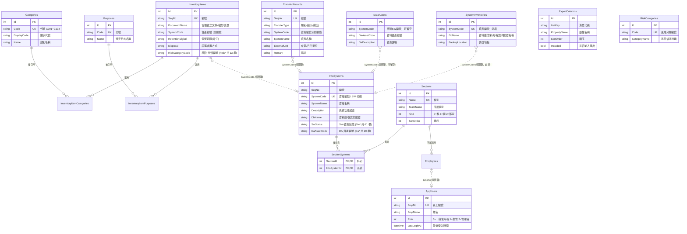

# 個資盤點管理系統 (PdInventory) — 架構文件

> 本文件由原始碼分析產出，說明系統的整體架構、模組職責、資料模型與資料表關聯。
>
> 另見 [欄位選項化盤點](欄位選項化盤點.md)：六張清單逐欄統計，列出哪些自由文字欄位
> 應改為下拉或複選、哪些要先正規化，以及兩個應該自動計算的欄位。

---

## 1. 系統概觀

PdInventory 是一套取代人工維護「個資清冊.xlsx」的 Web 系統，將原 Excel 各工作表（Sheet1～Sheet3、附表一、附表二、風險自評相關表）與外部資訊資產清單（軟體 SW／資料 DA）數位化，提供 CRUD、關鍵字搜尋、欄位排序、Excel 匯出與資料正規化。

| 項目 | 內容 |
|------|------|
| 應用框架 | ASP.NET Core MVC（.NET 10） |
| ORM | Entity Framework Core 10（**使用 Migrations**） |
| 資料庫 | SQLite（`App_Data/pdinventory.db`） |
| 前端 | Bootstrap 5.3.3、jQuery、jQuery Validation |
| 匯出 | ClosedXML（.xlsx） |
| 語言特性 | Nullable enable、ImplicitUsings enable |

### 啟動流程

1. `Program.cs` 建立 `WebApplication`，註冊 MVC、`AppDbContext`（SQLite）、**Session**（清單頁搜尋記憶用，30 分鐘閒置逾時）、**Cookie 驗證**與**授權原則**。
2. `InfoSystemBlocks.AssertViewModelsCoverAllFields()` 檢查編輯畫面的 ViewModel 是否與 `InfoSystem` 的欄位同步，不一致直接擲出例外。
3. `DbSeeder.Seed` 先呼叫 `db.Database.Migrate()` 建立／升級結構，再匯入 `Data/Seed/*.json` 種子資料（僅在對應資料表為空時匯入），最後在 `AppUsers` 為空時建立初始使用者。
4. HTTP 管線：例外處理 → HSTS → HTTPS 轉址 → **網站維護中**（開啟時才掛上）→ 路由 → **Session** → **驗證** → 授權 → 靜態資產。
5. 預設路由 `{controller=Home}/{action=Index}/{id?}`。

> **結構異動一律走 Migrations。** 早期版本使用 `EnsureCreated()`，但它不會替既有資料庫補上後來新增的資料表；現行資料庫已以 `InitialCreate` 建立基準點。新增欄位或資料表請執行：
> ```
> dotnet tool run dotnet-ef -- migrations add <名稱> --project PdInventory/PdInventory.csproj
> ```
> 工具版本定義於 repo 根目錄的 `.config/dotnet-tools.json`。

### 網站維護中模式（0918）

`web.config` 的環境變數 `Maintenance__Enabled` 改成 `true` 並存檔，**所有請求**（不分登入與否、角色，
連靜態檔也一樣）都會被導到 `/Maintenance`「網站維護中」畫面；改回 `false` 恢復。
`Maintenance__Message` 可選填一段說明（例如預計恢復時間），會顯示在畫面上。

```xml
<environmentVariable name="Maintenance__Enabled" value="true" />
<environmentVariable name="Maintenance__Message" value="預計 9/19 18:00 恢復" />
```

- 實作：`Helpers/MaintenanceMode.cs`（設定與中介軟體）、`MaintenanceController`、`Views/Maintenance/Index.cshtml`。
- ASP.NET Core 不讀 `web.config` 的 `<appSettings>`，因此開關放在 `<aspNetCore>` 的環境變數，
  對應設定鍵 `Maintenance:Enabled`（雙底線＝冒號）。開發環境（Kestrel，不讀 web.config）改 `appsettings.json` 同名設定。
- IIS 偵測到 web.config 變更會自動重啟網站，所以**啟動時讀一次**即可；改完存檔就生效，不必重新部署。
- 中介軟體放在路由與驗證之前，維護期間不會碰資料庫；維護畫面不套版面、樣式內嵌，因此不必替 css/js 開例外。
  畫面回 `Cache-Control: no-store`，避免維護結束後瀏覽器還顯示舊畫面。關閉時直接開 `/Maintenance` 會被送回首頁。
- 不用 IIS 內建的 `app_offline.htm`：那會把整個網站卸載，也就不會顯示系統自己的畫面。
- ⚠ **部署時注意**：專案根目錄的 `web.config` 會隨發佈輸出（發佈時 SDK 只補 `processPath` 等必要值，
  上面兩個環境變數會保留）。若上線環境的 web.config 正設成維護中，用新版覆蓋後會變回 `false`。

---

## 2. 分層架構

- **表現層 (Views)**：Razor 檢視。`_Layout.cshtml` 提供頂部標題列與可收合的左側導覽清單；`Views/Shared/` 另有跨控制器共用的 `CreateAll`／`EditAll`。
- **控制層 (Controllers)**：16 個控制器。
- **輔助層 (Helpers)**：跨控制器的共用邏輯，含身分（`ICurrentUser`／`IEmployeeDirectory`）與授權（`IAssetAccess`／`Policies`）。
- **資料存取層 (Data)**：`AppDbContext`、`DbSeeder`、`Migrations/`。
- **模型層 (Models)**：`Entities.cs` 內 14 個實體，含中文 `Display` 標籤與驗證屬性；`Models/ViewModels/` 為畫面專用模型。
- **持久層**：SQLite 單一檔案資料庫。

### 2.1 架構圖


---

## 3. 控制器與功能對應

### 3.1 主表（六張清單）

| 控制器 | 來源對應 | 路徑 | 動作 |
|--------|---------|------|------|
| `SoftwareController` | 資訊資產清單－軟體(SW) | `/Software` | Index / **Details** / Edit(POST) / Delete / Export |
| `DataController` | 資訊資產清單－資料(DA) | `/Data` | Index / Edit(POST) / Delete / Export |
| `SystemsController` | Sheet3 資訊系統盤點表 | `/Systems` | Index / **Create** / **Edit** / Delete / Export |
| `InventoryController` | Sheet1 個人資料檔案盤點表 | `/Inventory` | Index / Details / Create / Edit / Delete / Export |
| `RiskController` | 個人資料安全風險自評表 | `/Risk` | Index / Details / Create / Edit / Delete / Export |
| `TransfersController` | Sheet2 系統自動拋轉清單 | `/Transfers` | Index / **Details** / Create / Edit / Delete / Export |

### 3.2 維護資料（下拉選項來源）

> 每張維護清單都有「使用中」欄位，按下去會開明細視窗列出是哪些資料在用（見 8.6）。

| 控制器 | 所屬表單 | 對應 | 路徑 |
|--------|---------|------|------|
| `CategoriesController` | 個資盤點表 | 附表一 個人資料類別 | `/Categories` |
| `PurposesController` | 個資盤點表 | 附表二 特定目的列表 | `/Purposes` |
| `RiskCategoriesController` | 風險自評表 | 3-1 風險分類編號 | `/RiskCategories` |
| `RiskImpactsController` | 風險自評表 | 3-2 評估影響程度 | `/RiskImpacts` |
| `RiskLikelihoodsController` | 風險自評表 | 3-3 評估發生可能性 | `/RiskLikelihoods` |
| `RiskEffectivenessController` | 風險自評表 | 3-4 有效性評估 | `/RiskEffectiveness` |
| `DepartmentsController` | **共用** | 部門（利潤中心＋部門） | `/Departments` |
| `SectionsController` | **權限設定**（0918 前在共用） | **科別**（科／組／部室，以及各科負責的系統）——**權限的核心**，見 8.2 | `/Sections` |
| `EmployeesController` | **權限設定**（0918 前在共用） | 人員（員編＋姓名＋部門＋組別＋科別）**＋登入帳號的角色**，見 8.5 | `/Employees` |
| `FieldOptionItemsController` | 依欄位所屬表單 | **欄位選項**（六個欄位共用一個畫面） | `/FieldOptionItems?field=` |

> 另有 `NotesController`（盤點重點）不在側邊欄，見 3.4。
| `OpsStaffController` | **共用** | 資管維運（組別＋姓名） | `/OpsStaff` |

`Categories`／`Purposes`／`RiskCategories` 具代號唯一性驗證，且被引用時禁止刪除。

**側邊欄的三層結構**（`Helpers/MaintenanceCatalog.cs`）：
維護資料 → 六張表單（外加「共用」）→ 各表單的維護項目。
之後還會有很多欄位改成可維護的選單，屆時只要在 `MaintenanceCatalog.Groups`
對應的群組裡加一行，側邊欄就會自己長出來，不必再動 `_Layout.cshtml`。
「共用」放的是不專屬於任何一張表單的選單——部門這種六張表都會用到的，
（人員與科別 0918 起移到側邊欄的「權限設定」群組，那裡不走 `MaintenanceCatalog`，直接寫在 `_Layout.cshtml`）
目前還沒有項目，畫面上顯示「尚無維護項目」。

第二層用原生的 `<details>`／`<summary>`，收合不必寫 JavaScript；
**目前所在頁面的那一組由伺服器端直接加上 `open`**，換頁時不會先展開再收起來。
群組的展開狀態不跨頁記憶——每次導覽都會落在某個群組裡，該開的那一組本來就會開著。

### 3.4 盤點重點（導覽列的「?」）

管理者記錄每次系統盤點的重點，全站導覽列的「?」按鈕點開就看得到。
與各表單的資料無關，純粹是給人看的筆記，因此不掛在側邊欄也沒有資產編號之類的關聯。

| 動作 | 路徑 | 權限 |
|------|------|------|
| 清單（標題＋更新時間，新的在前） | `/Notes/List` | 已登入 |
| 單筆內容 | `/Notes/Detail/{id}` | 已登入 |
| 新增／編輯表單 | `/Notes/Form/{id?}` | **管理者** |
| 存檔 | `/Notes/Save` | **管理者** |

四個動作回的都是**部分檢視**，由 `site.js` 抓回來換進 `_Layout` 的彈跳視窗，
在同一個視窗裡切換清單 → 內容 → 編輯三個畫面。之所以不做成三個獨立頁面：
這個功能要能從任何一頁打開、看完關掉就回到原本的工作，導頁會把使用者手上的
搜尋條件與捲動位置弄丟。

非管理者看得到清單與內容，但畫面上不會出現[新增]與[編輯]；
按鈕隱藏只是操作防呆，真正的把關是控制器上的 `[Authorize(Policy = Policies.Admin)]`
——直接對 `/Notes/Form`、`/Notes/Save` 送請求會被導到權限不足的畫面。

### 3.3 其他

| 控制器 | 說明 |
|--------|------|
| `HomeController` | 首頁：12 張卡片，顯示各表筆數 |
| `ExportSettingsController` | 匯出欄位維護：拖曳排序、勾選是否納入、還原預設（限管理者） |
| `AccountController` | 登入／登出（`[AllowAnonymous]`） |
| `MaintenanceController` | 「網站維護中」畫面（`[AllowAnonymous]`），見 1. 的網站維護中模式 |
| `PermissionsController` | 舊的權限設定網址，0918 起只轉址到人員畫面（帶 `userId` 就開那個人的編輯畫面） |

### 3.4 SW / DA / 系統盤點三者的共用畫面

三張清單是**同一筆資訊資產的三個面**，因此檢視與新增／編輯畫面是共用的：

| 畫面 | 位置 | 提供者 |
|------|------|--------|
| 檢視 | `Views/Data/Details.cshtml` | `DataController.Details` |
| 新增 | `Views/Shared/CreateAll.cshtml` | `DataController.Create` |
| 編輯 | `Views/Shared/EditAll.cshtml` | `DataController.Edit` |

**三者各自獨立成表**（`InfoSystems`／`DataAssets`／`SystemInventories`），以 `SystemCode` 弱關聯。
統一畫面只是把「同一套系統的三份資料」放在一起呈現，不代表它們是同一列。

#### 為什麼主鍵是 DataAssets.Id

0910 之前這三個畫面的網址參數都是 **InfoSystems 的主鍵**，代價是
**沒有 SW 關聯的資料資產完全沒有網址可以開**——各組的 PC／NB 那 13 筆只能檢視與刪除。

關係的實際形狀是：

```
SW  →  恰好一筆 DA        （原本有 6 筆 SW 沒有 DA，0910 補建空白列補齊）
DA  →  0 或 1 筆 SW       （13 筆終端設備類的資料資產沒有 SW）
SW  →  0 或 1 份盤點表    （55 套系統裡只有 26 套有）
```

**DA 是唯一涵蓋得了全部資料的那一張表**，因此改以 `DataAssets.Id` 當統一畫面的主鍵
（`/Data/Create`、`/Data/Edit/{id}`、`/Data/Details/{id}`）。SW 與盤點表都由
`AssetGroups.LoadAsync` 依 `SystemCode` 找回來，三個面裝進一個 `AssetGroup`。

配套：`DataAssets.SystemCode` 加了排除空字串與已刪除的唯一索引。同一個 SW 若有兩列 DA，
就會有兩個網址指向同一套系統，而畫面只找得到其中一列，另一列會安靜地編不到。

- **編輯**：三個區塊各是獨立 `<form>`，分別 POST 到 `Software/Edit`、`Data/Edit`、`Systems/Edit`，各自繫結自己的 ViewModel（`SoftwareEditViewModel`／`DataEditViewModel`／`SystemEditViewModel`），欄位名稱以 `Software.`／`Data.`／`Sheet3.` 前綴區隔，因此送出的內容只可能屬於該區塊，三個 `<form>` 也不會產生重複的 DOM id。
  三條路徑的路由 `id` **都是 DataAssets 的主鍵**，各區塊要寫哪一列一律由它推出來，不看表單送回的 `Id`。
- **新增**：只有一個送出按鈕。勾了「無SW資產編號」就只建 DataAssets 一列；沒勾則 SW 與 DA 必成對建立（DA 是主鍵，缺了它這筆 SW 之後打不開），盤點表只在真的有填內容時才建。
- **關聯不可改動**：DA 與 SW 的關聯在建立時決定，之後所有存檔路徑都以資料庫現值覆寫 `SystemCode`（業務端 0910 確認）。因此那 13 筆孤兒也永遠不會接上 SW。
- **編號（`SeqNo`）已停用**：甲方 0910 決定不再使用，畫面上改成 hidden，欄位保留是為了既有資料（55 筆裡有 22 筆本來就沒有編號）。它沒有資料庫唯一索引，新資料一律空白不會撞號。
- **DA 清單不列出資產編號空白的列**：那 6 筆是補建的空白列，只為了讓統一畫面有主鍵可用，本身沒有內容。要編它們從 SW 清單或盤點表清單進去。清單與匯出用同一個查詢，兩邊一致。
- **來源判斷**：清單頁的連結帶 `from`，`ListSource` 比對白名單後決定[取消]／[回列表]回到哪一張清單；`from` 也隨表單 POST 帶回，存檔導回本頁時不會遺失。

---

## 4. 跨控制器共用邏輯（Helpers）

| 類別 | 職責 |
|------|------|
| `SearchMemory` | 清單頁搜尋條件的 Session 記憶。**六張主表共用同一格**，因為 SW-XXX 是各表都有的欄位，可用它串連不同表單。登入與登出時由 `AccountController.ForgetSessionState()` 清空——記的是「這個人剛剛看到哪一筆」，不清的話下一個在同一台機器登入的人，一進清單頁搜尋欄就已經填著前一個人看過的資產編號 |
| `ListSource` | 將網址上的 `from` 比對白名單（Software／Data／Systems），決定返回哪一張清單 |
| `ExportCatalog` | 各清單可匯出的欄位集合，並與 `ExportColumns` 設定合併出實際順序 |
| `ExcelExporter` | 依設定的欄位順序產生 .xlsx（ClosedXML） |
| `InfoSystemBlocks` | SW／DA／系統盤點三個編輯區塊與各自實體之間的欄位搬移 |
| `ICurrentUser` | 目前操作者（員工編號、姓名、角色），軌跡與授權判斷的來源 |
| `IEmployeeDirectory` | 身分來源，`Remote`／`Simulated` 兩種實作可切換 |
| `IAssetAccess` | 單筆資料的修改權限判斷 |
| `Policies` | 授權原則名稱常數 |
| `RoleDisplay` | 角色的中文名稱與說明 |
| `AssetPicker` | 資產編號下拉的選項，以及依編號查出資產名稱 |
| `FieldOptions` | 值固定、不隨組織異動的欄位選項（是／否、資產狀態、等級…） |

### 4.1 搜尋條件記憶

- **儲存**：按[搜尋]時存搜尋欄文字；點[檢視]／[編輯]時存該筆的資產編號。
- **清除**：[清除]／[取消]／[回列表] 的連結一律帶 `clear`。
- **使用**：直接進入清單頁（網址沒有 `q`）時帶出記憶值並套用篩選。

> `clear` 與 `q` 都以「網址有沒有這個參數」判斷，不用 action 參數：`bool` 參數只接受 `true`/`false`，`clear=1` 會綁不進來而靜默失效。

### 4.2 匯出欄位

- 欄位群組以**屬性名稱前綴**推導而非寫死清單：Software = 基本欄位 + `Sw*`、Data = 基本欄位 + `Da*`、Systems = 其餘（Sheet3）欄位；其他清單為該實體全部欄位。
- `ExportColumns` 只存屬性名稱與順序、**不存標題**，標題一律取自模型的 `[Display]`，維持單一來源。
- 合併時以模型為準：設定裡已不存在的屬性忽略、模型新增的補到最後，欄位增刪不會讓既有設定失效。

---

## 5. 資料模型

| 實體 | 資料表 | 說明 |
|------|--------|------|
| `PdCategory` | `Categories` | 附表一：個人資料類別（`C001`～`C134`） |
| `Purpose` | `Purposes` | 附表二：特定目的 |
| `InventoryItem` | `InventoryItems` | Sheet1 個資檔案盤點 **＋ 風險自評欄位**（`Risk*`） |
| `TransferRecord` | `TransferRecords` | Sheet2：系統自動拋轉清單 |
| `InfoSystem` | `InfoSystems` | 軟體(SW)資產（73 欄）：SW 欄位 ＋ 共用識別 ＋ 與 DA 合併的 9 個共用欄位 |
| `DataAsset` | `DataAssets` | 資料(DA)資產。`SystemCode` **可留空**——終端設備類的資料資產沒有對應的 SW |
| `SystemInventory` | `SystemInventories` | 資訊系統／資料庫／檔案伺服器盤點表。`SystemCode` 必填 |
| `RiskCategory` | `RiskCategories` | 3-1：風險分類編號 |
| `RiskImpactLevel` | `RiskImpactLevels` | 3-2：評估影響程度 |
| `RiskLikelihoodLevel` | `RiskLikelihoodLevels` | 3-3：評估發生可能性 |
| `RiskEffectivenessLevel` | `RiskEffectivenessLevels` | 3-4：有效性評估 |
| `ExportColumn` | `ExportColumns` | 各清單匯出欄位的順序與是否納入 |
| `AppUser` | `AppUsers` | 系統使用者：員工編號、姓名、角色、最後登入時間 |
| `Section` | `Sections` | 科別：名稱、所屬組別、類型（科／組／部室）、排序 |
| `SectionSystem` | `SectionSystems` | 某個科負責某套系統（多對多） |

### 關聯與約束 (`AppDbContext.OnModelCreating`)

- `PdCategory.Code`、`Purpose.Code`、`RiskCategory.Code`、三個風險等級的 `Level` 建立唯一索引。
- `ExportColumn` 以 (`ListKey`, `PropertyName`) 唯一。
- `InventoryItem` ⟷ `PdCategory`：多對多，中介表 `InventoryItemCategories`。
- `InventoryItem` ⟷ `Purpose`：多對多，中介表 `InventoryItemPurposes`。
- **主檔識別欄位唯一**（`AddUniqueKeyIndexes`）：`InfoSystems.SystemCode`、`InventoryItems.SeqNo`、`TransferRecords.SeqNo`，皆以 `HasFilter` 排除空字串（SQLite 視空字串為相等值，未填代碼的資料會互撞）。
  `DaAssetCode` **刻意不設唯一** —— 來源資料本來就允許一筆 DA 對應多個 SW（DA-049 同時對應 SW-048 與 SW-049）。
- `AppUser.EmpNo` 唯一（排除已停用）。
- `Section.Name` 唯一；`SectionSystem` 以 (`SectionId`, `InfoSystemId`) 為複合主鍵，兩個外鍵皆為 Cascade，
  並有查詢篩選 `!x.InfoSystem.IsDeleted`（系統被軟刪除後對照不再生效）。
- `Employee.SectionId` → `Section`，**Restrict**：還有人掛在底下的科別刪不掉。
- `InfoSystem` 上**刻意沒有**反向導覽屬性：匯出會把 `InfoSystem` 的每個公開屬性都當成一個 Excel 欄位。

### 5.1 資料正規化

原 Excel「使用資料(欄位)」「特定目的」為手動輸入文字，寫法混亂（如 `COO三`、`C00三`、`Ｃ○○三`）。系統改為多對多關聯，匯入時正規化為標準代號。維護檔項目若仍被盤點項目引用，刪除會被擋下。

### 5.2 弱關聯 (Soft Reference)

以下為透過欄位值配對、**未在資料庫層建立外鍵**的邏輯關聯：

- `DataAsset.SystemCode` ↔ `InfoSystem.SystemCode`（**可留空**）
- `SystemInventory.SystemCode` ↔ `InfoSystem.SystemCode`（必填）
- `InventoryItem.SystemCode` ↔ `InfoSystem.SystemCode`
- `TransferRecord.SystemCode` ↔ `InfoSystem.SystemCode`
- `InfoSystem.DaAssetCode`：資料資產編號，一筆 DA 可對應多筆 SW

前兩者雖然沒有外鍵，但畫面上**已改為從資訊資產清單挑選**（`Helpers/AssetPicker.cs`），
個資盤點、風險自評、拋轉清單的新增與編輯都不再是自由輸入，打錯編號造成關聯斷裂的機會因此消失。
資產名稱一律由伺服器端依編號查出後寫入，不採信畫面送回來的值。

編號已不在清單中的舊資料（例如該資產後來被刪除）仍會保留：下拉會多出一個
標示「已不在資產清單中」的選項並選中它，不會因為選不到而在存檔時被清成空白。

### 5.3 合併欄位盤點（重新匯入前必看）

多張來源試算表寫進同一張資料表時，若兩張表的某個欄位被塞進**同一個實體屬性**，
後匯入的那份會蓋掉先匯入的，而且畫面上看不出來。以下是逐欄查核後的結果。

> **DA 與盤點表已於 `SplitDataAssetsAndInventories` 各自獨立成表**，
> 因此它們自己的欄位不再有互相覆蓋的問題。本節仍然重要的是兩點：
> 一是 `InfoSystems` 上那些由多張來源表共同寫入的欄位；
> 二是 DA 來源檔仍然帶著 9 個已合併到 SW 的欄位，**匯入時必須略過**。

**InfoSystems（來源：SW 表、第 6 表系統盤點；DA 表以「關連SW編號」比對）**

SW 與 DA 兩張表有 14 個同名欄位，其中 12 個在實體裡各有獨立屬性（`SwStatus`／`DaStatus`、
`SwRiskOwner`／`DaRiskOwner`、`SwOwnerUnit`／`DaOwnerUnit`…），互不干擾。真正共用的是：

| 實體屬性 | 由誰寫入 | 說明 |
|----------|----------|------|
| `SystemCode` | SW 表「資產編號」、第 6 表「資產編號」；DA 表以「關連SW編號」比對 | 跨表關聯鍵，設計如此 |
| `SystemName` | SW 表「軟體資產名稱」、第 6 表「軟體資產名稱」 | 同名同義，衝突風險低 |
| `SeqNo` | 第 6 表「編號」 | 單一來源 |
| ~~`Description`~~ | 已於 0904 拆開，見下方 | 已解決 |

**資產說明三張表各有各的欄位**（0904 業務端決議，`MoveDescriptionToSw`）：

| 欄位 | 屬於 |
|------|------|
| `InfoSystem.SwDescription`（標題「SW-資產說明」） | SW |
| `DataAsset.DaDescription`（標題「DA-資產說明」） | DA |
| （無） | 盤點表的資產說明已移除 |

原本 SW 與第 6 表（盤點表）共用一個 `Description`，內容一律取自 SW 表。0904 依決議
把盤點表那一個移除、SW 改用獨立的 `SwDescription`——因為欄位內容本來就是 SW 的，
migration 直接改名，55 筆內容原封不動帶過去。**重新匯入任一張來源表都不會再蓋掉另一張。**

第 6 表原本的「系統功能描述」是操作層級的長文（「使用部門: … 主要功能: 1. … 2. …」），
與 SW 的一句話資產說明性質不同，26 筆重疊中只有 3 筆相同；先前依決議已全數改用 SW 的版本，
這次拆分沒有把它救回來——需要的話得從來源檔重新匯入。

`DaDescription` 內容取自 DA 表。DA 表只涵蓋 29 個編號，未涵蓋的 SW-048、049、075、154、167
依決議沿用 SW 的文字，不留空白。

因此**重新匯入時**：SW 表的資產說明寫入 `Description`，DA 表的寫入 `DaDescription`，
第 6 表的「系統功能描述」不再寫入資料庫（已由 SW 的版本取代）。

**SW 與 DA 已刻意合併的 9 個欄位**

下列欄位原本 SW 與 DA 各有一份，但記錄的是同一個資產的同一件事，已合併為 SW 那一份
（`Da*` 屬性已移除，見 `MergeSharedSwDaFields`）。
**DA 的來源試算表至今仍然帶著這 9 欄，每次匯入都必須略過**，否則會蓋掉 SW 的值：

| 合併後的屬性 | 原本的 DA 屬性 | 合併時捨棄的 DA 值 |
|--------------|---------------|-------------------|
| `SwStatus` | `DaStatus` | 0 筆（完全相同） |
| `SwOwnerUnit` | `DaOwnerUnit` | 0 筆 |
| `SwCustodianUnit` | `DaCustodianUnit` | 0 筆 |
| `SwRiskOwner` | `DaRiskOwner` | 0 筆 |
| `SwConfidentiality` | `DaConfidentiality` | 3 筆 |
| `SwIntegrity` | `DaIntegrity` | 6 筆 |
| `SwAvailability` | `DaAvailability` | 10 筆 |
| `SwLocation` | `DaLocation` | 12 筆（另 18 筆只是分隔符號寫法不同） |
| `SwAssetValue` | `DaAssetValue` | 13 筆（皆因上述三個等級不同而連帶不同） |

這 9 個欄位只由 **SW 區塊**維護，DA 的清單、檢視與匯出照常顯示但不可編輯。

> **重新匯入 DA 來源檔時必須略過這 9 欄。** 那份試算表仍然有這些欄位，
> 直接匯入會把 SW 的值蓋掉——與資產說明是同一類問題。

`SwAssetValue` 另外改為由 `AppDbContext.RecalculateAssetValues` 自動計算
（＝機密性＋完整性＋可用性），畫面上唯讀。

**InventoryItems（來源：第 3 表風險自評、第 4 表個資盤點）**

分得乾淨：13 個 `Risk*` 屬性來自第 3 表，其餘 31 個來自第 4 表，
連容易撞名的「編號」與「備註」都各有各的（`RiskDataSeqNo`／`SeqNo`、`RiskRemark`／`Remark`）。

唯一的例外是 `SeqNo`／`SystemCode`／`DocumentName`：正常由第 4 表寫入，
但當初有 3 筆風險自評在第 4 表找不到對應（編號 19、20、21），改由第 3 表寫入這三個欄位。
重新匯入第 4 表時，這 3 筆不會被涵蓋。

因此風險自評的編輯畫面開放改 `SystemCode` 與 `DocumentName`（0915）——那 3 筆只存在於
第 3 表，不從這裡維護就沒有別的地方可以改。兩張清單列的是同一批資料列，
所以在這裡改名，個資盤點表那邊也會跟著變，這是刻意的。

> **編輯畫面的編號／資產編號／資產名稱是唯讀的**（0904）。位置與新增畫面一致，
> 都在最上方的「基本資訊」卡，但編輯時不開放改動——資產編號串起 SW／DA／盤點表／
> 個資盤點／拋轉／風險自評六張表，又是權限判斷的依據，在畫面上改掉會讓那些關聯
> 瞬間斷開。`readonly` 只是操作防呆，`SoftwareController.Edit` 存檔時一律以資料庫
> 現值覆寫這三個欄位，改表單繞不過去。新增時仍然要填。

**TransferRecords（來源：第 5 表）**

單一來源，沒有合併欄位。不過「類別」原本有 `拋出/拋入`、`拋入/拋出` 這種
**一格塞兩件事**的寫法（共 4 筆）。2026-09-03 業務端確認一筆只會是單向，
已各拆成兩筆，除類別外欄位完全相同，新那筆的編號是 `原編號-1`
（編號有唯一索引，不能同號；用後綴才留得住來源並在排序時緊接原筆）。
拆完 51 筆變 55 筆，選項也只留「拋入／拋出」。

### 5.4 欄位選項化

值固定的欄位已由自由輸入改為下拉，選項集中在 `Helpers/FieldOptions.cs`：

| 清單 | 欄位數 | 內容 |
|------|-------|------|
| 資訊資產清單-軟體(SW) | 23 | 11 個是／否型 ＋ 12 個固定分類（資產狀態、系統類別、機密性／完整性／可用性 1~4、RTO／RPO…） |
| 資訊資產清單-資料(DA) | 1 | 資產類別 |
| 個資檔案盤點表-人為產出 | 5 | 個資當事人類別、符合個資法§6條件、公司角色、對外傳遞方式、期限屆滿後處置方式 |
| 系統自動拋轉清單 | 1 | 類別（只有拋入／拋出） |

與「維護資料」表的分工：單位、人員、地點那類**會隨組織變動**的選項要進資料表，
由管理者自行維護；`FieldOptions` 只放本質上不會變的（是／否、線上／下線、等級 1~5）。

**來自維護資料表的選項**走另一條路：`Helpers/LookupOptions.cs`（Scoped 服務，
`_ViewImports` 已 `@inject`，畫面直接用 `Lookup.Departments`）。做成注入而不是每個
控制器塞 ViewBag，是因為這類欄位會愈來愈多，四、五個畫面各補一次很快就會漏掉一個。

選項的來源因此有三種，判斷標準是「誰有權改它」：

| 來源 | 欄位數 | 放什麼 | 誰維護 |
|------|-------|-------|-------|
| `FieldOptions`（寫死） | 15 | 邏輯上封閉的：是／否、有／無、Y／N、型錄常數 | 工程師改程式 |
| `Departments`／`Employees`／`OpsStaffs` | — | 組織資料：單位、人員 | 管理者，各有專屬畫面 |
| `FieldOptionItems` ＋ `OptionCatalog` | 22 | 值固定但業務端要能自己增刪的欄位 | 管理者，22 個欄位**共用一個畫面** |

判斷標準是「誰有權改它」：**是／否沒有第三個答案**，開放編輯只會讓人加出「也許」；
反過來說，只要是業務詞彙（時間級距、傳輸方式、版控工具…），歷史上就一定會長出新值。

第三種的二十一個欄位（側邊欄依欄位所屬表單分組）：

| 欄位 | 型式 | 選項 | 群組 |
|------|------|------|------|
| SW-權責單位 | 單選 | 7 | SW |
| SW-保管單位 | 單選 | 1 | SW |
| SW-風險擁有者 | 單選 | 1 | SW |
| SW-位置 | 多選 | 5 | SW |
| SW-自行/委外開發 | 多選 | 3 | SW |
| SW-自行/委外維護 | 多選 | 3 | SW |
| SW-使用語言種類 | 多選 | 11 | SW |
| SW-軌跡留存方式 | 單選 | 4 | SW |
| SW-資產狀態 | 單選 | 2 | SW |
| SW-與AD整合 | 單選 | 5 | SW |
| SW-版控系統 | 單選 | 2 | SW |
| SW-上版方式 | 單選 | 2 | SW |
| SW-程式碼存取方式 | 單選 | 2 | SW |
| SW-第三方元件程式/版本 | 單選 | 4 | SW |
| SW-回復時間目標(RTO) | 單選 | 8 | SW |
| SW-回復資料目標(RPO) | 單選 | 11 | SW |
| DA-有無機敏資料 | 多選 | 5 | DA |
| DA-確認-資料備份方式 | 多選 | 8 | DA |
| 個資當事人類別 | 單選 | 3 | 個資盤點表 |
| 傳輸：對外傳遞方式 | 單選 | 3 | 個資盤點表 |
| 處置：期限屆滿後處置方式 | 單選 | 3 | 個資盤點表 |

**現有資料的每一個值都在選項清單裡，只有 DA-確認-資料備份方式例外**（0916 選項化）。
這一欄的 8 個選項由業務端直接指定，而不是從資料歸納出來的，因此有 3 種既有寫法對不上、
共 26 筆：`異地抄寫`（15 筆，都是與「資料庫同地備份」組合出現）、`信義-板橋`（10 筆）、
`資料庫同地備份.異地存放`（1 筆，用句點當分隔符）。資料沒有動——勾選清單會把對不上的值
照樣列出來並打勾、標「不在選項中」，存檔時保留原值，等業務端決定要對到哪個選項。

### 程式碼有依賴的四個選項怎麼保護

`SW-機密性／完整性／可用性` 與 `SW-系統類別` 也開放維護了，但它們是程式邏輯的一部分，
所以 `OptionField` 多了兩個旗標，維護畫面會擋住會弄壞計算的操作：

| 旗標 | 用在 | 擋什麼 |
|------|------|-------|
| `NumericOnly` | 機密性／完整性／可用性 | 新增非數字的選項——`AppDbContext.RecalculateAssetValues` 要把三個值相加，混進「高」會讓資產價值**安靜地停止計算** |
| `ReservedValues` | 系統類別的「核心系統」 | 刪除它——`site.js` 的 `CORE_CATEGORY` 直接寫死這個字串，刪掉之後資產價值 > 10 的阻擋視窗就失效 |

保留值在畫面上有「系統保留」標記，刪除鈕直接停用；後端也擋一次，改表單繞不過去。

### 還留在 `FieldOptions` 的 15 個

全是邏輯封閉的（是／否 6、是／否/NA 2、有／無/NA 2、Y／N 1、
資料控制者／資料處理者 1、拋入／拋出 1、軟體／資料 2）——開放編輯沒有好處，
多一個「也許」並不會讓資料更準確。

> 這些欄位共用一個控制器、靠 `?field=` 區分（作法比照「維護匯出」的 `?list=`），
> 否則每個欄位都要複製一份幾乎一樣的 CRUD。要多一個可維護的選項，
> 在 `OptionCatalog.Fields` 加一行、把畫面那一格改成吃 `Lookup.OptionsFor(...)`，
> 側邊欄與維護畫面都會自己長出來。
>
> 維護畫面**只能新增與刪除，不能改值**：選項的值就是各表單欄位裡存的文字，
> 在維護畫面改字不會連帶更新那些資料，只會讓它們變成選不到的舊值。
> 還被引用的選項也不給刪，畫面上直接顯示每個選項有幾筆在用。

**`SW-保管單位` 與 `SW-風險擁有者` 原本是寫死的固定值**（「資訊系統開發一部」與「陳映玲」），
畫面唯讀、存檔時由 `AppDbContext` 蓋回去，換人就得改常數重新部署。0910 依業務端要求
改成一般的可維護選單：兩個常數移除、`AppDbContext` 不再干預，現有值各建成一個選項，
之後換人在維護畫面加一筆就好。

| 欄位 | 來源 | 型式 |
|------|------|------|
| SW-業務權責單位 | 部門 | 單選 |
| SW-使用者帳號權限授與 | 部門 | 多選 |
| SW-使用單位 | 部門 | 多選 |
| DA-使用單位 | 部門 | 多選 |
| SW-維運人員 | 資管維運 | 多選 |
| SW-程式換版人員 | 資管維運 | 多選 |
| SW-應用系統維護人員 | 人員 | 多選 |
| SW-程式設計人員 | 人員 | 多選 |
| SW-115上檢視人員 | 人員 | 單選 |
| DA-115檢視人員 | 人員 | 單選 |
| SW-應用系統主管 | 人員（**只列備註＝組長／科長**） | 單選 |
| 拋轉清單-負責內部單位 | 部門 | 單選 |

> 選單型式（單選／多選）是依現有資料決定的：欄位裡出現過分隔符的做成多選，
> 一路都只有單一值的做成單選。改一個欄位的型式只要換掉畫面上那一行。

**多選欄位怎麼存**：欄位在資料庫仍然是一格文字、以 `/` 分隔（來源 Excel 本來就這樣寫），
畫面用 `_MultiCheckList.cshtml` 的勾選清單，勾選由 `site.js` 同步進一個 hidden input。
控制器與 ViewModel 完全不必更動，之後要把別的欄位改成多選只要在畫面換一行。

切開字串的規則集中在 `Helpers/MultiValue.cs`，畫面與後端統計共用同一套，有三個地雷：
括號裡的斜線不是分隔符（`總公司各單位(作業中心/國際法人部)` 是一個值）、
`N/A` 是一個完整的答案不是 N 跟 A，以及來源試算表另外用過 `;#` 當分隔符
（`自行開發;#委外開發`）——只切 `;` 會在下一個值前面留一個 `#`，變成選不到的髒值。

0903~0904 已把 SW-位置／SW-自行委外開發／SW-自行委外維護／SW-使用語言種類／
DA-有無機敏資料 五欄的分隔符統一成 `/`（共 36 筆），並依業務端指示合併了四組寫法：

| 原值 | 併入 | 筆數 |
|------|------|------|
| `沒有` | `無` | 1 |
| `JAVA` | `Java` | 2 |
| `資料庫 - etl 匯入變動紀錄` | `資料庫` | 1 |
| `LogFile` | `檔案` | 1 |

之後由 `AppDbContext` 於存檔時自動維持（`ApplyFixedAndMultiValueFields`）。

> 沒有動過的多選欄位不會重寫 hidden 的值，因此不碰它就不會有任何變化；
> 一旦動過，順序會照維護資料表的順序重排。

> 改成下拉最容易踩的坑是**既有值不在選項中**——`<select>` 會顯示空白，
> 使用者一按儲存就把原本的資料清掉，而且畫面上完全看不出來。
>
> 風險自評的「控制有效性等級」踩過這個坑：既有資料存的是 `2`，
> 3-4 維護檔給的選項卻是 `2：良好`，17 筆全部顯示空白，一存檔連帶把風險值
> 也算成空的（風險值 = 三個等級的前置數字相乘，少一個就算不出來）。
> 0904 已把那 17 筆正規化成 Label 格式，四個風險下拉也都補上了保留原值的選項。
> 因此 `FieldOptions.ItemsFor` 會在目前值不在選項中時額外插入一個標示過的選項並保留原值。
> 導入這 29 個欄位前也逐欄比對過，確認選項涵蓋資料庫現有的每一個值。

**資產價值與系統類別的連動**（`site.js`）：機密性／完整性／可用性一改就即時重算資產價值；
**超過** 10 時顯示提醒（剛好等於 10 不算），送出時若系統類別不是「核心系統」
則跳出阻擋視窗並提供一鍵修正。**這條規則已由業務端於 2026-09-03 確認。**

0902 匯入後的 55 筆：資產價值 > 10 的 19 筆全部是核心系統，規則零例外
（核心系統從 8 筆增為 24 筆就是這麼來的）。另有 5 筆資產價值 ≤ 10 卻標成核心系統
（SW-016、017、024、026、117），這不違反規則——業務端定的是「> 10 就必須是核心系統」，
反向並未禁止，因此保留來源檔的標註，畫面也不會擋。

> 這兩層都在瀏覽器端，屬於操作防呆；要真正強制得在控制器加伺服器端檢核。

其餘欄位的盤點結果（哪些該做成維護資料、哪些要先正規化）見
[欄位選項化盤點](欄位選項化盤點.md)。

### 5.5 以程式直接寫入資料庫時的注意事項

歷次匯入都是以腳本直接對 SQLite 下 SQL，不經過 EF。這樣做要留意兩個欄位的格式，
寫錯不會有任何錯誤訊息，但畫面會壞掉：

- **`RowVersion` 必須是大寫**。EF（Microsoft.Data.Sqlite）把 Guid 存成
  `A239140D-12F2-4E21-A961-8AE1D5C2D059` 這種**大寫**文字，而 SQLite 的 `=`
  對文字大小寫敏感。若腳本寫入小寫，並行控制的 `WHERE RowVersion = @p` 永遠不成立，
  那些資料列**從此在畫面上存不了檔**，而且只會看到「這筆資料已被其他人修改」的訊息，
  完全看不出真正的原因。0821 匯入曾經踩過這個坑，33 筆全中。
- **`UpdatedBy` 要填得出是誰做的**，匯入請用可辨識的字串（例如 `(SW 匯入 0821)`），
  不要留空或沿用他人帳號。

匯入後可以用這段檢查：

```sql
SELECT COUNT(*) FROM InfoSystems WHERE RowVersion <> upper(RowVersion);  -- 應為 0
```

### 5.6 資料庫進版控前要先 checkpoint

`App_Data/pdinventory.db` 有納入版控，但它是 **WAL 模式**：寫入先進 `pdinventory.db-wal`，
主檔要等 checkpoint 才更新，而 `.gitignore` 排除了 `*.db-wal`。
兩者相加的後果是 **commit 收進去的主檔會落後於實際資料**——
在本機完全看不出來（SQLite 開啟時會連 `-wal` 一起讀），只有 clone 出去才會發現少了東西。
0903 的員編補零就是這樣漏掉的。

`.githooks/pre-commit` 會在每次 commit 前自動處理：把 WAL 折回主檔，
主檔因此改變的就一併 `git add`。這代表**純程式的 commit 也可能被帶入資料異動**，
所以 hook 每次都會印一行說明，不會靜靜地做。checkpoint 失敗（資料庫被其他程式鎖住）
會直接中止 commit，而不是放行一份不完整的資料。

Hook 靠 `core.hooksPath` 生效，而這是**本機設定、不會跟著 clone**。新環境要執行一次：

```bash
git config core.hooksPath .githooks
```

需要手動 checkpoint 時：

```bash
python -c "import sqlite3;c=sqlite3.connect('PdInventory/App_Data/pdinventory.db');c.execute('pragma wal_checkpoint(TRUNCATE)')"
```

---

## 6. 資料表關聯圖



---

## 7. 畫面樣式慣例

版面樣式集中在 `wwwroot/css/site.css`，三個類別即涵蓋全站：

| 類別 | 用途 |
|------|------|
| `.pd-table` | 清單表格：實色斑馬紋 `#f8f9fa` 與 hover `#dbe9ff`、直向分隔線、`.5625rem .625rem` 內距 |
| `.pd-spec` / `.pd-grid` | 檢視頁規格列：標籤欄固定 **190px** 灰底色帶（單欄／雙欄兩種） |
| `.pd-form` | 表單標籤：與規格列同字級同對比 |

> 斑馬紋與 hover 是**覆寫 Bootstrap 變數**（`--bs-table-striped-bg`／`--bs-table-hover-bg`），而非直接設 `background-color` —— Bootstrap 5.3 用 `box-shadow: inset` 疊色，硬蓋背景色無效。

其他共用行為（`site.js`）：左側導覽收合、清單表頭排序、到最頂部／到最底部。收合狀態存 `localStorage`，並在 `<head>` 的 inline script 於首次繪製前套用，避免換頁閃爍。

---

## 8. 身分與權限

### 8.1 角色

| 動作 | 管理者 `Admin` | 主管 `Manager`／一般使用者 `AssetOwner` |
|------|---------------|----------------------------------------|
| 檢視六張清單 | 全部 | 全部 |
| **修改** | 全部 | **自己科別負責的系統**（組長＝全組），見 8.2 |
| **新增** | ✔ | ✘ |
| **刪除** | 全部 | **同修改：能改就能刪**（0918），見 8.6 |
| 維護資料、維護匯出、權限設定 | ✔ | ✘ |

**0917 起角色只決定「能做哪些動作」，「能改哪些系統」由科別決定。** 原本主管不受資產限制、
全部系統都能改，改版後主管與一般使用者**目前完全相同**。保留「主管」這個角色是因為業務端
表示新增權限日後可能開放給主管——屆時改 `Program.cs` 的 `Policies.CreateAssets` 與
`AssetAccess.CanCreate` 兩處即可，不必重新區分誰是主管。

**刪除跟著修改走**（業務端 0918）：0917 一度限管理者，0918 改為能改就能刪。判斷在
`AssetAccess.CanDeleteAsync`，目前直接等於 `CanModifyAsync`；仍獨立成一個方法，日後刪除要比
修改嚴格時只改那裡，控制器與清單畫面不必動。放寬的前提是**業務資料一律軟刪除**（見 8.6），
唯一不是軟刪除的是風險自評的「刪除」——它清空的是風險欄位。

「資產負責人」改稱「**一般使用者**」（列舉值 `AssetOwner` 不動，既有資料不必轉換）——
原本的意思是「名下有資產的人」，改成依科別授權之後已經沒有「名下」這回事。

第一次登入成功的人自動建檔，角色是一般使用者、人員表沒有科別，也就是只能看不能改。

### 8.2 能修改哪些系統：人員 → 科別 → 系統

```
人員表的科別 ──┬─ 科   → 這個科負責的系統（SectionSystems）
               ├─ 組   → 同組別底下所有「科」負責系統的聯集（組長用）
               └─ 部室 → 沒有（部室主管與副主管靠管理者角色）
```

算法只有一份：`Helpers/SectionScope.cs`。權限判斷（`AssetAccess`）、人員畫面的「可修改系統」、
人員編輯畫面的明細、科別畫面的負責系統全部走它，**畫面上看到的範圍就是實際生效的範圍**。

**組的範圍用算的，不另外存。** 業務端提供的對照檔裡，每個組那一列剛好都等於底下各科的聯集。
另存一份的話，科多了一套系統而組那列忘了加，兩邊就對不上了。

授權單位仍是資產編號：修改權限涵蓋那套 SW，以及 `DataAssets`、`SystemInventories`、
`InventoryItems`（個資盤點與風險自評）、`TransferRecords` 裡 `SystemCode` 相同的所有列。

> ⚠ **沒有任何科負責的系統**（0917 匯入時有 SW-048、049、080、167）與**沒有 SystemCode 的資料資產**
> （各組的 PC／NB）都只有管理者能修改。日後分配到科別時，由管理者在科別畫面勾選。

**每一件事只在一個地方改：**

| 要改的事 | 在哪裡改 |
|---|---|
| 某個科負責哪些系統 | 權限設定 → 科別 |
| 某個人屬於哪個科（組別跟著自動帶出） | 權限設定 → 人員 |
| 某個人的角色 | 權限設定 → 人員（與科別在同一張表單） |

**不保留逐筆的例外授權。** 原本的 `AssetOwners` 全系統只有 2 筆（林子耕的 SW-034、SW-036），
都落在他自己的帳務服務科裡，沒有真正的例外存在，因此整張表移除。

**0917 的資料來源**：業務端提供的「權限管理檔」（科別 → 負責系統）與「人員檔」（人員 → 科別、職稱），
由 `ImportSectionPermissionsData` migration 匯入（結構在前一個 `SectionBasedPermissions`）。
人員檔裡沒有的人不指定科別（例如蔡逸君），授權只照業務端提供的名單給。
角色依職稱**只調高不調低**：陳映玲升為管理者、周佩君升為主管。

### 8.3 兩層授權

| 層級 | 做法 | 位置 |
|------|------|------|
| 畫面層 | `[Authorize(Policy = ...)]`，原則集中在 `Program.cs` 定義 | 控制器只掛屬性 |
| 單筆層 | `IAssetAccess.CanModifyAsync(systemCode)`／`CanDeleteAsync(systemCode)` | `Edit`／`Delete` 動作內 |

單筆層無法用 Policy 表達：授權在動作執行前就判斷完了，那時候還沒讀出使用者按的是哪一筆，Policy 看不到那一列的 `SystemCode`。

| 原則 | 允許的角色 | 掛在哪 |
|------|------------|--------|
| `Policies.ViewAssets` | 已登入 | 六張主要清單的控制器 |
| `Policies.CreateAssets` | 管理者（0917 起；日後可能開放給主管） | 各控制器的 `Create` 動作 |
| `Policies.Admin` | 管理者 | 維護資料控制器、`ExportSettings`、`Employees`、`Sections`、`Permissions`（轉址） |

另有 `FallbackPolicy` 要求登入，沒掛任何屬性的動作預設也受保護，新增控制器時忘了加屬性不會變成開放。

畫面上的[新增]／[編輯]／[刪除]按鈕依同一組判斷顯示，但**按鈕消失不是防護** —— 直接輸入網址或偽造表單送出，都會被控制器內的檢查擋下並導向 `/Account/Denied`。

### 8.4 登入流程

系統不保管帳號密碼，一律交給公司 AD 驗證：

```
瀏覽器 → /Account/Login（帳號＋密碼）
       → IEmployeeDirectory.AuthenticateAsync(account, password)
       → LDAP bind（bind 成功即代表密碼正確）
       → 以同一條已驗證的連線搜尋該帳號的屬性
       → 取得 EmpNo / EmpName
       → 已被停用就到此為止（見 8.5）
       → 查（或建立）AppUsers 與 Employees
       → 簽發 Cookie（EmpNo / 姓名 / 角色三個 Claim）
```

`appsettings.json` 的 `Employee` 區段決定實作：

| Mode | 實作 | 用途 |
|------|------|------|
| `Simulated` | `SimulatedEmployeeDirectory` | **AD 密碼驗證暫停**：只要輸入帳號就能登入。登入頁會顯示黃色提示、密碼欄停用（刻意保留不隱藏，讓人看得出來之後會用到），帳號欄附上已建檔帳號的建議清單 |
| `Ldap` | `LdapEmployeeDirectory` | 向 `Employee:Ldap:Host` 驗證帳號密碼並讀取屬性 |

**與公司提供的教學文件的差異**：文件是寫給 .NET Framework 4.7.2 的 MVC 5，
用 `System.DirectoryServices` 的 `DirectoryEntry`；本專案是 ASP.NET Core (.NET 10)，
改用 .NET 支援的 `System.DirectoryServices.Protocols`。驗證流程（先 bind 再搜尋）
與安全要求（跳脫篩選條件、統一錯誤訊息、不記密碼）完全相同。
文件的 `FormsAuthentication.SetAuthCookie` 對應到本專案既有的 Cookie 驗證。

**員工編號要補零**。AD 的帳號是六碼的 `183253`，但本系統既有資料是七碼的 `0183253`
（舊的身分端點回傳的格式）。不處理的話同一個人會變成兩筆使用者，而且新的那筆沒有任何權限。
`LdapOptions.EmpNoLength`（預設 7）會在登入時把純數字帳號補足前導零。

> **這是 `IEmployeeDirectory` 的契約，不是某個實作的細節**：`AuthenticateAsync` 回傳的
> `EmpNo` 一定要是正規化過的。模擬模式原本漏了這一步，於是手動輸入 `5784` 就建出一個
> 姓名空白、與 `0005784` 互不相干的第二個帳號（0904 與 0911 各發生過一次，
> 三筆誤建的帳號已於 0911 清除）。兩個實作現在都走 `Helpers/EmpNo.cs`。

**姓名的取法**：優先用 `displayName`；AD 的 `cn` 是「183253 [林子耕]」這種格式，
會取中括號裡的姓名。

登入失敗一律回覆「帳號、密碼或存取權限不正確。」，不區分帳號不存在與密碼錯誤——
兩者若給不同訊息，等於幫忙確認哪些帳號存在。診斷資訊只寫進伺服器記錄，
其中 LDAP ErrorCode `49` 是帳密錯誤、`81` 是連不到網域控制站，可用來區分設定問題與使用者輸入錯誤。

軌跡欄位記的是 `ICurrentUser.Name`，格式為「姓名(員工編號)」—— 姓名可能重複，帶上編號才追得到人。

---

### 8.5 人員表與登入帳號的對接

三者以**員工編號**（七碼，見 `Helpers/EmpNo.cs`）相認，規則集中在
`Helpers/UserProvisioning.cs`，登入與人員維護兩邊共用。各自負責的事：

| | 負責 |
|---|---|
| 人員表 `Employees` | 組織名冊，也是各表單人員欄位下拉的來源；**姓名就是欄位裡存的值** |
| 帳號 `AppUsers` | 能不能登入、什麼角色（能改哪些系統看人員表的科別） |
| 員工目錄（LDAP） | 驗證帳號密碼、提供員編與姓名 |

**0918 起兩張表在同一個畫面設定**（側邊欄：權限設定 → 人員）。原本人員在「維護資料-共用」、
角色在另一個「權限設定」畫面，兩張表一人一筆，畫面之間只能互相連來連去。合併後：

- 清單多了「角色」欄與角色篩選；人員表單分成「基本資料」與「權限」兩塊，
  「權限」裡有科別、角色，以及依目前科別與角色推出的可修改系統明細（依科分段）。
- 存檔一次寫兩張表。人員表沒有並行控制、帳號有：表單帶著帳號的 `RowVersion`，
  兩位管理者同時改同一個人的角色，後存的會被擋下。
- 改角色的保護（不能調降自己、不能調降最後一位管理者）從原本的權限設定搬到這裡
  （`UserProvisioning.RoleChangeBlockReason`）；另外**不能改自己的員編**——登入身分以員編
  記在 Cookie 裡，改掉等於當場失去對應的帳號。
- 舊網址 `/Permissions` 轉到人員清單，`/Permissions?userId=N` 轉到那個人的編輯畫面。

**員編異動時帳號跟著走**（`UserProvisioning.SyncUserForEmployeeAsync`，0918 補上）。
以前人員表改員編不會動到帳號：舊員編的帳號留著、新員編等下次啟動才補建一個新的，
角色就這樣斷掉（黃鈺棠從 0012478 改成 0014078 就多出一個帳號，
已由 `MergeDuplicateAccount0012478` migration 併入 0014078 並停用舊帳號）。現在的規則：

| 情況 | 帳號怎麼處理 |
|---|---|
| 改員編，新員編已有帳號（含停用過的） | 沿用那個帳號（停用過的復原），舊員編的帳號停用 |
| 改員編，新員編沒有帳號 | 舊帳號直接改號，角色與登入紀錄都留著 |
| 原本沒有員編、補上 | 建立帳號 |
| 清空員編 | 帳號停用（與刪除一樣擋「最後一位管理者」） |

每次存檔也會把帳號的姓名同步成人員表的姓名。

**新增有兩條路，兩邊都會同時存在：**

1. **使用者自己先登入**——人員表沒有他就自動建一筆：員編與姓名取自 LDAP，
   部門固定填 `資訊系統開發一部`、備註固定填 `使用者登入自動帶入資料；資料待補`
   （兩個常數在 `Employee.DefaultDepartment` / `Employee.AutoCreatedRemark`，
   管理者可以用備註把待補的人篩出來）。帳號給一般使用者、沒有科別。
2. **管理者先在人員表建檔**——存檔時一併建立帳號，角色就是表單上選的（預設一般使用者）；
   那個人之後登入就直接對應到已經設好的權限，
   不必等他先登入一次才看得到。沒填員編的人（名冊本來就缺編號的兩位、幾家委外廠商）
   不會建立帳號——沒有編號就無從對應登入身分，畫面上會說明。

> **人員表的職務記在「備註」欄**（0904 名冊改版）：填「組長」或「科長」的人才會出現在
> `SW-應用系統主管` 的下拉（`Employee.ManagerRemarks`／`IsManager`）。
> 舊名冊的「科別」欄新版來源已不再提供，既有的值（前台核心科、創新研發科…）予以保留，
> 但已經沒有任何邏輯依賴它。
>
> `IsManager` 是算出來的、不是資料庫欄位，**EF 翻不成 SQL**——用到它的查詢要先
> `ToList()` 取回再排序或篩選，否則執行時會擲 `InvalidOperationException`。

**人員表的每個有員編的人都有帳號。** 兩條新增路徑本來就會同時建立兩邊，
但名冊是直接匯入資料表的、沒有經過那條路，因此 `DbSeeder.SeedUsersForEmployees`
每次啟動都會補上缺的帳號（角色一律給一般使用者，**已存在的不動**——
角色是設定過的）。沒有員工編號的人略過：兩張表以員編相認，
沒有編號就無從對應登入身分（目前只有 `N/A` 那一筆）。

**刪除一律是軟刪除，而且兩邊一起。** 管理者從人員表刪除時：

- 先擋引用：還被任何一個對照欄位使用中就不給刪，要求先改掉那些資料。
- 再擋「刪掉就沒人能管了」：不能刪自己，也不能刪掉最後一位管理者。
  改角色時本來就有這兩道保護，但**刪除是另一條路、繞過了它們**——
  而管理者通常不會出現在應用系統主管、維護人員那些欄位裡，引用數是 0，
  刪除鈕根本不會擋他。只剩一位管理者又被刪掉，就再也沒有人進得了權限設定了。
- 通過後在 `Employees` 與 `AppUsers` 各加一筆刪除註記（`IsDeleted`／`DeletedAt`／`DeletedBy`），
  **資料不會真的從資料庫消失**。全域查詢篩選讓他從人員清單與所有人員下拉中消失。
- 那個人**不能再登入**，會看到「這個帳號已被停用，請洽系統管理者。」——
  密碼其實是對的，所以不必再用含糊的訊息遮掩，否則他只會反覆重試。
- 同一個人日後再從人員表新增回來時，**人員與帳號都是復原原本那筆**，不是新增一筆同員編的
  ——角色、組別科別的歷史都還在，也不會撞到唯一索引
  （兩張表的唯一索引都加了 `IsDeleted = 0` 的篩選）。

**姓名只在建檔時寫入，之後不隨員工目錄更新。** 人員表的姓名就是 SW／DA 各欄位裡存的
文字，自動改名會讓那些資料瞬間變成查不到來源的孤兒值。真要改名請走人員維護畫面，
畫面會先提示有幾筆資料在用。

**五個測試帳號（1111111~5555555）已移除**（`SoftDeleteEmployeesAndUsers` 這個 migration
連同他們名下的授權一起硬刪除）。帳號改為與人員表對接之後，能登入的人一律要在人員表裡
有一筆，這些在員工目錄與人員表都不存在的假帳號沒有立足之地。
模擬模式的登入頁改為可以自行輸入姓名，好在沒有 AD 的環境驗證第一條流程。

---

### 8.6 刪除的兩套規則

**業務資料一律軟刪除**：只加 `IsDeleted`／`DeletedAt`／`DeletedBy` 註記，
全域查詢篩選讓它從清單、檢視與匯出中消失。這些是甲方的稽核資料，誤刪救不回來
比留一列註記麻煩得多。

| 實體 | 對應清單 |
|------|---------|
| `InfoSystem` | 資訊資產清單-軟體(SW) |
| `DataAsset` | 資訊資產清單-資料(DA) |
| `SystemInventory` | 資訊系統／資料庫／伺服器盤點表 |
| `InventoryItem` | 個人資料檔案盤點表（風險自評也是同一列） |
| `TransferRecord` | 系統自動拋轉清單 |
| `Employee`／`AppUser` | 權限設定 → 人員（兩邊一起，見 8.5） |

> ⚠ **風險自評的「刪除」不是軟刪除**：風險自評與個資盤點共用 `InventoryItems` 同一列，
> 不能對整列加刪除註記，因此它做的是**清空這一筆的 13 個風險欄位**，清掉就救不回來
> （確認視窗會明講「清空的內容無法復原」）。個資盤點清單的刪除才是軟刪除，
> 風險自評表中同一列也會跟著消失。

**刪除確認視窗**（0918）：取代瀏覽器原生的 `confirm()`。共用的視窗放在 `_Layout.cshtml`
（`#deleteModal`），由 `site.js` 依刪除表單上的屬性填內容：

| 屬性 | 內容 |
|------|------|
| `data-delete-kind` | 資料種類（軟體資產、部門…） |
| `data-delete-name` | 這一筆的名稱 |
| `data-delete-mode` | `soft`＝軟刪除（說明可請管理者復原）、`hard`＝硬刪除、`clear`＝清空欄位（兩者都標明無法復原） |
| `data-delete-detail` | 連帶影響（選填），例如 SW 的「同一筆資產的 DA 與盤點表資料會一併刪除」 |

刪除鈕是 `type="button"` 並帶 `data-confirm-delete`——沒有 JS 就送不出去，寧可刪不了也不要
沒確認就刪掉。預設焦點在「取消」，誤按 Enter 不會刪；按下確定後按鈕停用，避免連點送出兩次。
名稱一律以 `textContent` 放入，含引號的名稱不會像原本內嵌在 `confirm('…')` 字串裡那樣壞掉。

**維護資料是硬刪除，但一律先擋引用**。各表單存的是**文字而不是外鍵**，
資料庫不會替我們擋——刪掉一個還在用的值，引用它的資料就變成查不到來源的孤兒值，
畫面上還不會有任何警告。因此每張維護清單都有「使用中」欄位，
用到的筆數 > 0 時刪除鈕直接停用，後端也擋一次（改表單繞不過去）：

| 維護清單 | 對照 |
|---------|------|
| 附表一 個人資料類別 / 附表二 特定目的 | 個資盤點表（關聯表，EF 直接擋） |
| 3-1 風險分類編號 | 風險自評的 `RiskCategoryCode` |
| 3-2 / 3-3 / 3-4 等級 | 風險自評的三個等級欄位 |
| 部門 / 人員 / 資管維運 | SW、DA、拋轉清單的單位與人員欄位 |
| 欄位選項 | 各自對照的欄位，另有「系統保留」值不准刪 |

統計集中在 `Helpers/LookupUsage.cs`，多選欄位（以 / 分隔）一律走 `MultiValue.Contains`，
不能用等號比對。

> 3-2~3-4 的等級有兩種寫法：畫面上選的是「2：中等」，但既有資料也有只存「2」的
> （有效性評估那一欄就是），兩種都要算成使用中，否則會誤判成沒人用而放行刪除。

#### 「使用中」明細視窗

按下「N 筆」會開一個彈跳視窗，列出到底是哪些資料在用；點任一列會**另開分頁**
到該筆的檢視畫面（維護畫面通常已經搜尋過、捲到一半，在原分頁導走會把那些狀態弄丟）。

```
維護畫面 → 使用中「N 筆」→ 彈跳視窗（依來源清單分段）→ 檢視畫面（新分頁）
```

**數字與明細必須出自同一份資料**，這是這個功能最重要的一條。`LookupUsage.RowsAsync`
回傳的是明細列，清單上的「N 筆」由 `rows.Count` 得出（`CountsAsync`），
刪除前的檢查也走同一支（`CountAsync`）。三處若各寫一套查詢遲早會不一致——
徽章寫 3 筆、點開只有 2 筆，而且沒有任何東西會報錯。原本各控制器裡那幾份
`CountUsageAsync` 就是這種重複，已一併收掉。

每一列顯示哪幾欄由 `UsageList` 帶著走（`Helpers/UsageRow.cs`），畫面不寫死任何一張表：

| 來源清單 | 每列顯示 | 檢視畫面 |
|---------|---------|---------|
| 資訊資產清單－軟體(SW) | 資產編號、資產名稱 | `Data/Details/{DataAssets.Id}` |
| 資訊資產清單－資料(DA) | 關連資產編號、資料資產編號 | 同上 |
| 資訊系統／資料庫／伺服器盤點表 | 資產編號、資產名稱 | 同上 |
| 個人資料檔案盤點表 | 資產編號、資產名稱、含個資之文件/檔案/表單 | `Inventory/Details` |
| 系統自動拋轉清單 | 資產編號、資產名稱、類別 | `Transfers/Details` |
| 個人資料風險自評表 | 資產編號、資產名稱、個資文件名稱 | `Risk/Details` |

另外每一列都會標出**命中的是哪一個欄位**。不能省：同一筆 SW 可能在「使用單位」與
「業務權責單位」兩個欄位都填了同一個部門，不寫出來會看起來像同一列重複了兩次。

十個維護畫面共用同一段 JavaScript，各畫面只要在徽章上掛
`data-usage-kind` / `data-usage-value`（欄位選項再加 `data-usage-field`），
不必自己寫任何程式。

> 盤點表目前沒有任何欄位吃維護資料，因此那一段不會有資料出現。
> `LookupUsage` 仍然保留它的設定，之後盤點表要加下拉時只要多登記一個欄位。

**例外，硬刪除是對的**：`ExportColumn`（匯出欄位設定）與 `SectionSystem`（科別負責的系統）
——它們本身就是「當下的設定狀態」，整批重建才是正確語意，留刪除註記反而礙事。

---

## 9. 已知限制

- **被停用的人若 AD 帳號還在，登入會被擋下**。規格沒有說這種情況要怎麼處理，
  目前的選擇是尊重管理者的刪除動作：擋登入並請他找管理者，而不是自動把人復活。
  要放行的話，請管理者從人員表把那個人新增回來（原本的角色會一併復原）。
- **`SW-應用系統主管` 只剩 1 筆 `N/A` 對不上**：0904 重新匯入名冊後，職務改記在**備註**
  （組長 6 人、科長 13 人，共 19 位主管），下拉改抓這兩種職務——原本對不上的
  林大鈞、施凱家、邱永嬌、張永顯都是科長，16 筆一次解決。剩下的 `N/A` 不是人。
- **委外廠商不進維護表**：業務端決定廠商名稱「可以下拉、也可以自行輸入」，
  自行輸入的名稱**不回寫維護表**。人員類的多選欄位因此都有一個「自行輸入」框
  （`_MultiCheckList` 的 `AllowCustom`），`SW-委外廠商` 則是 `<datalist>`——
  建議清單直接取自資料現有的值。原本混在人員表／資管維運裡的五家廠商
  （奇唯／奇狐／嘉實／全景／敦陽(廠商)）已經移出。
- **維護資料表裡有一批「代號待補」的資料**：既有資料中出現、但不在甲方 0903 清單裡的
  單位（14 筆）、維運人員（1 筆）與人員（8 筆，含 奇唯／奇狐／嘉實／全景／敦陽(廠商)
  五家委外廠商，以及疑似打錯的 `黃緯洵`——名冊裡是 `黃緯珣`），
  先建進維護表把值留住，利潤中心／組別留空、
  備註註明來源，清單上以「待補」標示並排在最後。其中幾筆明顯不是部門——
  `B2C`、`全公司`、`不適用`、`公司高階主管跟財業督導`，以及
  `總公司各單位(作業中心/國際法人部/…)` 這種一格塞十個單位的寫法——
  要請甲方一起清。人員表的 員編 在來源名冊裡位數不一致（`7331`、`12033`、`0002876` 都有），
  匯入時已統一補成七碼（`Helpers/EmpNo.cs`，維護畫面存檔時也會過同一支），
  與 `AppUsers` 及 LDAP 回傳的格式一致——例如 `183253 林子耕` 已對齊成 `0183253`。
  還有 10 筆是空白（名冊本來就沒給的 2 位，加上前述 8 個對不上名冊的值），待甲方確認。
- **改名不會連帶更新引用它的資料**：各表單存的是文字而不是外鍵。維護畫面在編輯時會
  提示有幾筆在用，刪除時若還被引用會直接擋下。
- **AD 密碼驗證目前是暫停的**（0904，為了讓大家能測試）：`Employee:Mode` 設為 `Simulated`，
  只要輸入帳號就能登入。登入頁的密碼欄**保留但停用**——隱藏起來會讓人誤以為系統本來就
  不需要密碼。要恢復只要把 `Mode` 改回 `Ldap`，密碼欄自動啟用並回到 AD 驗證，
  測試用的帳號建議清單與姓名欄也會一併消失（已實測兩種模式都正常）。
- **LDAP 連線尚未在公司內網實測**：
  `Employee:Ldap` 的預設值是依 AD 範例 DN 推得，主機、連接埠、`AuthType`、是否走 LDAPS、
  帳號屬性是否為 `sAMAccountName`，都要由網域管理者確認。開發環境測試時 LDAP 回應
  ErrorCode 81（連不到網域控制站），這是預期的——切換到 `Ldap` 前請先確認
  Web Server 到網域控制站的 TCP 636（或 389）連通，且信任 AD 憑證鏈。
- **早期的 HTTP 身分端點做法已移除**：`GetPersonInfo.aspx` 與 `PersonInfoParser` 相關程式碼
  隨公司改用 LDAP 一併刪除，需要時可從 git 歷史取回。
- **刪除範圍**（業務端 0910 確認）：SW 清單與 DA 清單的刪除是**整筆資產**——SW、DA、盤點表
  三列一起軟刪除，因為三張清單是同一筆資產的三個面。只刪其中一列會留下打不開的殘骸：
  少了 DA，那筆 SW 就沒有編輯入口；少了 SW，DA 會指向一個已刪除的資產編號。
  兩個例外：沒有 SW 關聯的資料資產本來就只有一列，刪它就是刪它；
  盤點表清單的刪除只清掉盤點表那一列，那是「這套系統不需要盤點表」的意思
  （55 套裡本來就有 29 套沒有），SW 與 DA 留著。
- **沒有已刪除資料的檢視或還原畫面**：軟刪除的資料只能直接查資料庫（`WHERE IsDeleted = 1`）。
  業務端 0904 確認**不需要**這個畫面。
- **DA-管理員註記只有管理者能改**（0916）：其他角色在新增／編輯畫面看得到內容，但欄位是唯讀的。
  真正的把關在 `AppDbContext.ProtectAdminOnlyFields()`——非管理者存檔時，修改的一律還原成
  資料庫原值、新增的一律清空，改表單送假值也沒用。檢視畫面與匯出所有角色都看得到。
- **唯讀欄位的樣式**（0916）：`site.css` 對全站的 `.form-control[readonly]` 加上灰底、虛線框、
  右側鎖頭與「禁止」游標，標籤後面再掛一個「唯讀」小標籤（靠 `:has()`，舊瀏覽器只是少了小標籤）。
  Bootstrap 本身對 `[readonly]` 幾乎不加樣式，看起來跟能打字的欄位一樣。
- **修改者／修改時間只有一組**（0918）：來源試算表的 `SwModifiedBy`／`SwModifiedTime`／
  `DaModifiedTime` 原本另外存（0910 起由系統寫入、格式沿用試算表的 `2026/8/28 08:16`），
  0918 業務端決定併進系統軌跡 `UpdatedBy`／`UpdatedAt`，格式統一為 `許稚苓(0005784)`、
  `2026-09-11 14:06:07`。資料由 `MergeSourceSheetModifiedFields` migration 搬移：
  - 軌跡欄位已經是真人（`姓名(七碼員編)`，代表 0910 之後在系統裡存過檔）的不動——兩套本來就同一刻寫入。
  - 其餘改用試算表的值：SW 的修改者取第一個空白前的姓名對到人員表補上員編
    （`黃美倫 AngelaH (Yuanta)` → `黃美倫(0006341)`）；DA 的試算表只有時間、沒有修改者，修改者留空。
  - 五張主要資料表的 `CreatedAt`／`UpdatedAt`／`DeletedAt` 去掉小數秒；之後寫入的時間
    在 `StampAuditFields` 統一截到秒（`DeletedAt` 也是）。

  InfoSystem／DataAsset 的 `UpdatedBy`／`UpdatedAt` 宣告在原本那幾欄的位置、`Display` 沿用
  「SW-修改者」「SW-修改時間」「DA-修改時間」（DA 另加「DA-修改者」），匯出的欄位順序與標題不變。
  `SwReviewer`／`DaReviewer` 是業務流程紀錄（誰做了 115 上的檢視），仍然由人挑選，不自動寫入。
- **匯出標題全部是中文**（0918）：六張清單的軌跡欄位（建立者、建立時間、修改者、修改時間、
  並行控制標記、已刪除、刪除時間、刪除者）都補上 `[Display]`。匯出會帶出實體的**每一個**公開屬性，
  少了 `Display` 標題就直接是屬性名稱。日後在這幾個實體加屬性時記得一併加上。
  時間欄位匯出格式固定為 `yyyy-MM-dd HH:mm:ss`（`ExcelExporter.Format`），不跟伺服器地區設定走。
- **「是否為核心系統」已移除**：它與「SW-系統類別」記錄同一件事且曾經不一致，
  核心系統與否一律看系統類別（`RemoveSwIsCoreSystem`）。
- **表格排序在前端**：資料量皆在 50 筆內；業務端 0904 確認不需要分頁，因此維持現狀。
  表格掛上 `table-sortable` 就會自己長出排序（見 `site.js`），標了 `data-nosort` 的
  表頭不參與。六張主要清單與人員表已經有；其餘維護清單還沒掛，要的話加一個 class 即可。
- **原本權限設定畫面的前端快速篩選已隨畫面移除**（0918 合併進人員）：人員清單本來就有
  伺服器端搜尋（員編／姓名／部門／組別／科別／備註），再加上科別與角色篩選。
