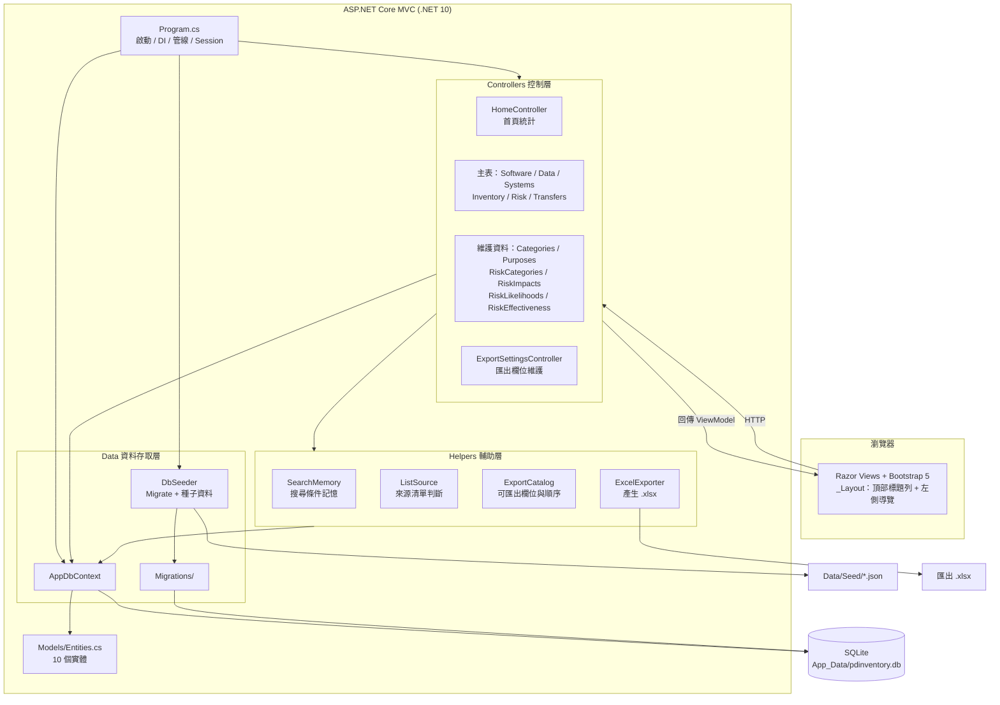
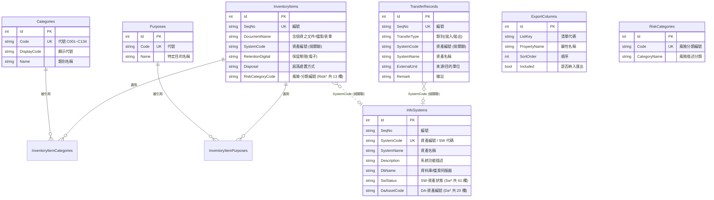

# 個資盤點管理系統 (PdInventory) — 架構文件

> 本文件由原始碼分析產出，說明系統的整體架構、模組職責、資料模型與資料表關聯。

---

## 1. 系統概觀

PdInventory 是一套取代人工維護「個資清冊.xlsx」的 Web 系統，將原 Excel 各工作表（Sheet1～Sheet3、附表一、附表二、風險自評相關表）與外部資訊資產清單（軟體 SW／資料 DA）數位化，提供 CRUD、關鍵字搜尋、欄位排序、Excel 匯出與資料正規化。

| 項目 | 內容 |
|------|------|
| 應用框架 | ASP.NET Core MVC（.NET 10） |
| ORM | Entity Framework Core 10（**使用 Migrations**） |
| 資料庫 | SQLite（`App_Data/pdinventory.db`） |
| 前端 | Bootstrap 5.3.3、jQuery、jQuery Validation |
| 匯出 | ClosedXML（.xlsx） |
| 語言特性 | Nullable enable、ImplicitUsings enable |

### 啟動流程

1. `Program.cs` 建立 `WebApplication`，註冊 MVC、`AppDbContext`（SQLite）與 **Session**（清單頁搜尋記憶用，30 分鐘閒置逾時）。
2. `DbSeeder.Seed` 先呼叫 `db.Database.Migrate()` 建立／升級結構，再匯入 `Data/Seed/*.json` 種子資料（僅在對應資料表為空時匯入）。
3. HTTP 管線：例外處理 → HSTS → HTTPS 轉址 → 路由 → **Session** → 授權 → 靜態資產。
4. 預設路由 `{controller=Home}/{action=Index}/{id?}`。

> **結構異動一律走 Migrations。** 早期版本使用 `EnsureCreated()`，但它不會替既有資料庫補上後來新增的資料表；現行資料庫已以 `InitialCreate` 建立基準點。新增欄位或資料表請執行：
> ```
> dotnet tool run dotnet-ef -- migrations add <名稱> --project PdInventory/PdInventory.csproj
> ```
> 工具版本定義於 repo 根目錄的 `.config/dotnet-tools.json`。

---

## 2. 分層架構

- **表現層 (Views)**：Razor 檢視。`_Layout.cshtml` 提供頂部標題列與可收合的左側導覽清單；`Views/Shared/` 另有跨控制器共用的 `CreateAll`／`EditAll`。
- **控制層 (Controllers)**：14 個控制器。
- **輔助層 (Helpers)**：4 個無狀態靜態類別，承載跨控制器的共用邏輯。
- **資料存取層 (Data)**：`AppDbContext`、`DbSeeder`、`Migrations/`。
- **模型層 (Models)**：`Entities.cs` 內 10 個實體，含中文 `Display` 標籤與驗證屬性。
- **持久層**：SQLite 單一檔案資料庫。

### 2.1 架構圖



---

## 3. 控制器與功能對應

### 3.1 主表（六張清單）

| 控制器 | 來源對應 | 路徑 | 動作 |
|--------|---------|------|------|
| `SoftwareController` | 資訊資產清單－軟體(SW) | `/Software` | Index / **Details** / Edit(POST) / Delete / Export |
| `DataController` | 資訊資產清單－資料(DA) | `/Data` | Index / Edit(POST) / Delete / Export |
| `SystemsController` | Sheet3 資訊系統盤點表 | `/Systems` | Index / **Create** / **Edit** / Delete / Export |
| `InventoryController` | Sheet1 個人資料檔案盤點表 | `/Inventory` | Index / Details / Create / Edit / Delete / Export |
| `RiskController` | 個人資料安全風險自評表 | `/Risk` | Index / Details / Create / Edit / Delete / Export |
| `TransfersController` | Sheet2 系統自動拋轉清單 | `/Transfers` | Index / **Details** / Create / Edit / Delete / Export |

### 3.2 維護資料（下拉選項來源）

| 控制器 | 對應 | 路徑 |
|--------|------|------|
| `CategoriesController` | 附表一 個人資料類別 | `/Categories` |
| `PurposesController` | 附表二 特定目的列表 | `/Purposes` |
| `RiskCategoriesController` | 3-1 風險分類編號 | `/RiskCategories` |
| `RiskImpactsController` | 3-2 評估影響程度 | `/RiskImpacts` |
| `RiskLikelihoodsController` | 3-3 評估發生可能性 | `/RiskLikelihoods` |
| `RiskEffectivenessController` | 3-4 有效性評估 | `/RiskEffectiveness` |

`Categories`／`Purposes`／`RiskCategories` 具代號唯一性驗證，且被引用時禁止刪除。

### 3.3 其他

| 控制器 | 說明 |
|--------|------|
| `HomeController` | 首頁：12 張卡片，顯示各表筆數 |
| `ExportSettingsController` | 匯出欄位維護：拖曳排序、勾選是否納入、還原預設 |

### 3.4 SW / DA / 系統盤點三者的共用畫面

三個控制器操作**同一張 `InfoSystems` 資料表**的不同欄位群組，因此檢視與新增／編輯畫面是共用的：

| 畫面 | 位置 | 提供者 |
|------|------|--------|
| 檢視 | `Views/Software/Details.cshtml` | `SoftwareController.Details`（SW 為主表） |
| 新增 | `Views/Shared/CreateAll.cshtml` | `SystemsController.Create` |
| 編輯 | `Views/Shared/EditAll.cshtml` | `SystemsController.Edit` |

- **編輯**：三個區塊各是獨立 `<form>`，分別 POST 到 `Software/Edit`、`Data/Edit`、`Systems/Edit`，各自只寫入該區塊欄位。共用欄位（編號／資產編號／資產名稱）只由「系統盤點」區塊維護，`ApplySoftwareFields`／`ApplyDataFields` 不寫入它們，避免各區塊以載入當下的舊值互相覆蓋。
- **新增**：只有一個送出按鈕。三個區塊同屬一筆尚未存在的資料，若拆成三次儲存會建出三筆殘缺資料。
- **來源判斷**：清單頁的連結帶 `from`，`ListSource` 比對白名單後決定[取消]／[回列表]回到哪一張清單；`from` 也隨表單 POST 帶回，存檔導回本頁時不會遺失。

---

## 4. 跨控制器共用邏輯（Helpers）

| 類別 | 職責 |
|------|------|
| `SearchMemory` | 清單頁搜尋條件的 Session 記憶。**六張主表共用同一格**，因為 SW-XXX 是各表都有的欄位，可用它串連不同表單 |
| `ListSource` | 將網址上的 `from` 比對白名單（Software／Data／Systems），決定返回哪一張清單 |
| `ExportCatalog` | 各清單可匯出的欄位集合，並與 `ExportColumns` 設定合併出實際順序 |
| `ExcelExporter` | 依設定的欄位順序產生 .xlsx（ClosedXML） |

### 4.1 搜尋條件記憶

- **儲存**：按[搜尋]時存搜尋欄文字；點[檢視]／[編輯]時存該筆的資產編號。
- **清除**：[清除]／[取消]／[回列表] 的連結一律帶 `clear`。
- **使用**：直接進入清單頁（網址沒有 `q`）時帶出記憶值並套用篩選。

> `clear` 與 `q` 都以「網址有沒有這個參數」判斷，不用 action 參數：`bool` 參數只接受 `true`/`false`，`clear=1` 會綁不進來而靜默失效。

### 4.2 匯出欄位

- 欄位群組以**屬性名稱前綴**推導而非寫死清單：Software = 基本欄位 + `Sw*`、Data = 基本欄位 + `Da*`、Systems = 其餘（Sheet3）欄位；其他清單為該實體全部欄位。
- `ExportColumns` 只存屬性名稱與順序、**不存標題**，標題一律取自模型的 `[Display]`，維持單一來源。
- 合併時以模型為準：設定裡已不存在的屬性忽略、模型新增的補到最後，欄位增刪不會讓既有設定失效。

---

## 5. 資料模型

| 實體 | 資料表 | 說明 |
|------|--------|------|
| `PdCategory` | `Categories` | 附表一：個人資料類別（`C001`～`C134`） |
| `Purpose` | `Purposes` | 附表二：特定目的 |
| `InventoryItem` | `InventoryItems` | Sheet1 個資檔案盤點 **＋ 風險自評欄位**（`Risk*`） |
| `TransferRecord` | `TransferRecords` | Sheet2：系統自動拋轉清單 |
| `InfoSystem` | `InfoSystems` | Sheet3 ＋ 軟體(SW) ＋ 資料(DA) 合併資產表（99 欄） |
| `RiskCategory` | `RiskCategories` | 3-1：風險分類編號 |
| `RiskImpactLevel` | `RiskImpactLevels` | 3-2：評估影響程度 |
| `RiskLikelihoodLevel` | `RiskLikelihoodLevels` | 3-3：評估發生可能性 |
| `RiskEffectivenessLevel` | `RiskEffectivenessLevels` | 3-4：有效性評估 |
| `ExportColumn` | `ExportColumns` | 各清單匯出欄位的順序與是否納入 |

### 關聯與約束 (`AppDbContext.OnModelCreating`)

- `PdCategory.Code`、`Purpose.Code`、`RiskCategory.Code`、三個風險等級的 `Level` 建立唯一索引。
- `ExportColumn` 以 (`ListKey`, `PropertyName`) 唯一。
- `InventoryItem` ⟷ `PdCategory`：多對多，中介表 `InventoryItemCategories`。
- `InventoryItem` ⟷ `Purpose`：多對多，中介表 `InventoryItemPurposes`。
- **主檔識別欄位唯一**（`AddUniqueKeyIndexes`）：`InfoSystems.SystemCode`、`InventoryItems.SeqNo`、`TransferRecords.SeqNo`，皆以 `HasFilter` 排除空字串（SQLite 視空字串為相等值，未填代碼的資料會互撞）。
  `DaAssetCode` **刻意不設唯一** —— 來源資料本來就允許一筆 DA 對應多個 SW（DA-049 同時對應 SW-048 與 SW-049）。

### 5.1 資料正規化

原 Excel「使用資料(欄位)」「特定目的」為手動輸入文字，寫法混亂（如 `COO三`、`C00三`、`Ｃ○○三`）。系統改為多對多關聯，匯入時正規化為標準代號。維護檔項目若仍被盤點項目引用，刪除會被擋下。

### 5.2 弱關聯 (Soft Reference)

以下為透過欄位值配對、**未在資料庫層建立外鍵**的邏輯關聯：

- `InventoryItem.SystemCode` ↔ `InfoSystem.SystemCode`
- `TransferRecord.SystemCode` ↔ `InfoSystem.SystemCode`
- `InfoSystem.DaAssetCode`：資料資產編號，一筆 DA 可對應多筆 SW

---

## 6. 資料表關聯圖



---

## 7. 畫面樣式慣例

版面樣式集中在 `wwwroot/css/site.css`，三個類別即涵蓋全站：

| 類別 | 用途 |
|------|------|
| `.pd-table` | 清單表格：實色斑馬紋 `#f8f9fa` 與 hover `#dbe9ff`、直向分隔線、`.5625rem .625rem` 內距 |
| `.pd-spec` / `.pd-grid` | 檢視頁規格列：標籤欄固定 **190px** 灰底色帶（單欄／雙欄兩種） |
| `.pd-form` | 表單標籤：與規格列同字級同對比 |

> 斑馬紋與 hover 是**覆寫 Bootstrap 變數**（`--bs-table-striped-bg`／`--bs-table-hover-bg`），而非直接設 `background-color` —— Bootstrap 5.3 用 `box-shadow: inset` 疊色，硬蓋背景色無效。

其他共用行為（`site.js`）：左側導覽收合、清單表頭排序、到最頂部／到最底部。收合狀態存 `localStorage`，並在 `<head>` 的 inline script 於首次繪製前套用，避免換頁閃爍。

---

## 8. 已知限制

- **沒有驗證與授權**：目前任何人都能存取所有功能。
- **刪除是整筆**：從 SW／DA／系統盤點任一清單刪除，移除的是整列 `InfoSystem`（含另外兩組欄位）。
- **稽核欄位是手打字串**：`SwModifiedBy`／`SwModifiedTime`／`SwReviewer`／`DaReviewer`／`DaModifiedTime` 皆為 `string`，系統不會自動寫入；亦無建立時間／建立者。
- **沒有並行控制**：無 `RowVersion`，兩人同時編輯時最後儲存者覆蓋前者且無提示。
- **表格排序在前端**：資料量皆在 50 筆內且未分頁；若日後加分頁，需改為後端排序。
- **Create／Edit 直接繫結整個實體**：`InfoSystem` 有 99 欄，尚未改用 ViewModel 限制可繫結欄位。
