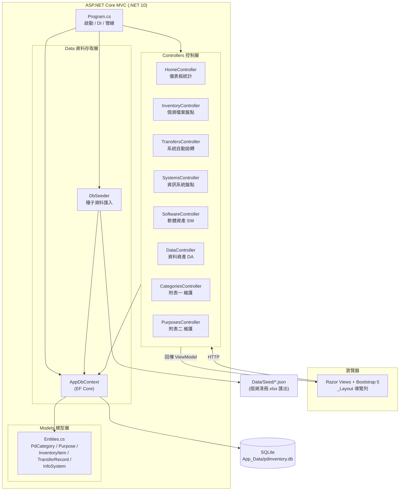
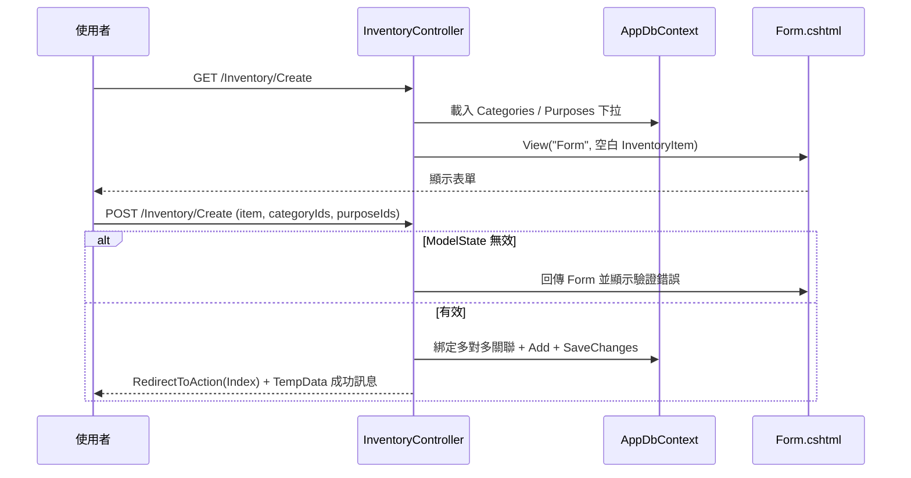
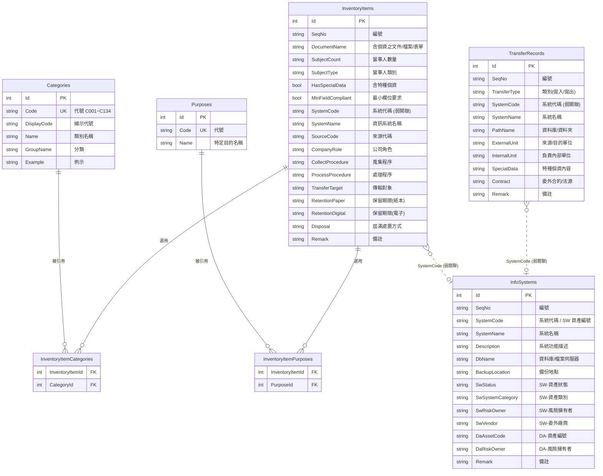

# 個資盤點管理系統 (PdInventory) — 架構文件

> 本文件由原始碼分析產出，說明系統的整體架構、模組職責、資料模型與資料表關聯。

---

## 1. 系統概觀

PdInventory 是一套取代人工維護「個資清冊.xlsx」的 Web 系統，將原 Excel 各工作表（Sheet1～Sheet3、附表一、附表二）與外部資訊資產清單（軟體 SW／資料 DA）數位化，提供 CRUD、關鍵字搜尋與資料正規化。

| 項目 | 內容 |
|------|------|
| 應用框架 | ASP.NET Core MVC（.NET 10） |
| ORM | Entity Framework Core 10 |
| 資料庫 | SQLite（`App_Data/pdinventory.db`，首次啟動自動建立） |
| 前端 | Bootstrap 5、jQuery、jQuery Validation（範本內建） |
| 語言特性 | Nullable enable、ImplicitUsings enable |

### 啟動流程

1. `Program.cs` 建立 `WebApplication`，註冊 MVC 與 `AppDbContext`（SQLite）。
2. 啟動時建立 `App_Data/` 目錄並透過 `DbSeeder.Seed` 建立資料庫、匯入 `Data/Seed/*.json` 種子資料。
3. 設定 HTTP 管線（例外處理、HSTS、HTTPS 轉址、路由、靜態資產）。
4. 預設路由 `{controller=Home}/{action=Index}/{id?}`。

---

## 2. 分層架構

系統採典型 ASP.NET Core MVC 分層：

- **表現層 (Views)**：Razor 檢視，`_Layout.cshtml` 提供導覽列，各功能有 `Index`／`Details`／`Form`（Create 與 Edit 共用）。
- **控制層 (Controllers)**：8 個控制器，處理 HTTP 請求、模型驗證、TempData 訊息。
- **資料存取層 (Data)**：`AppDbContext`（EF Core）、`DbSeeder`（種子資料匯入）。
- **模型層 (Models)**：`Entities.cs` 內 5 個實體，含中文 `Display` 標籤與驗證屬性。
- **持久層**：SQLite 單一檔案資料庫。

### 2.1 架構圖 (Mermaid)



---

## 3. 控制器與功能對應

| 控制器 | Excel 對應 | 路徑 | 主要動作 | 特殊邏輯 |
|--------|-----------|------|----------|----------|
| `HomeController` | — | `/` | `Index` | 儀表板：各實體筆數統計 |
| `InventoryController` | Sheet1 個人資料檔案盤點表 | `/Inventory` | Index/Details/Create/Edit/Delete | 多對多勾選（Categories、Purposes）；關鍵字搜尋 |
| `TransfersController` | Sheet2 系統自動拋轉清單 | `/Transfers` | Index/Create/Edit/Delete | 拋入/拋出 `type` 篩選；關鍵字搜尋 |
| `SystemsController` | Sheet3 資訊系統盤點表 | `/Systems` | Index/Details/Create/Edit/Delete | 管理 `InfoSystem` Sheet3 欄位 |
| `SoftwareController` | 資訊資產清單－軟體(SW) | `/Software` | Index/Create/Edit/Delete | 只更新 `InfoSystem` 的 SW 欄位（`ApplySoftwareFields`） |
| `DataController` | 資訊資產清單－資料(DA) | `/Data` | Index/Create/Edit/Delete | 只更新 `InfoSystem` 的 DA 欄位（`ApplyDataFields`） |
| `CategoriesController` | 附表一 個人資料類別 | `/Categories` | Index/Create/Edit/Delete | 代號唯一性驗證；被引用時禁止刪除 |
| `PurposesController` | 附表二 特定目的列表 | `/Purposes` | Index/Create/Edit/Delete | 代號唯一性驗證；被引用時禁止刪除 |

> `SystemsController`、`SoftwareController`、`DataController` 三者操作**同一張 `InfoSystems` 資料表**的不同欄位群組（Sheet3 基本欄位 / SW 欄位 / DA 欄位），透過選擇性欄位複製避免互相覆寫。

### 請求流程 (以 Inventory Create 為例)



---

## 4. 資料模型

系統共 5 個實體，對應資料表如下：

| 實體 | 資料表 | 說明 |
|------|--------|------|
| `PdCategory` | `Categories` | 附表一：個人資料類別維護檔（代號 `C001`～`C134`） |
| `Purpose` | `Purposes` | 附表二：特定目的維護檔 |
| `InventoryItem` | `InventoryItems` | Sheet1：個人資料檔案盤點表 |
| `TransferRecord` | `TransferRecords` | Sheet2：系統自動拋轉清單 |
| `InfoSystem` | `InfoSystems` | Sheet3 + 軟體(SW) + 資料(DA) 合併資產表 |

### 關聯設定 (`AppDbContext.OnModelCreating`)

- `PdCategory.Code`、`Purpose.Code` 建立**唯一索引**。
- `InventoryItem` ⟷ `PdCategory`：多對多，中介表 `InventoryItemCategories`。
- `InventoryItem` ⟷ `Purpose`：多對多，中介表 `InventoryItemPurposes`。

### 4.1 資料正規化

原 Excel「使用資料(欄位)」「特定目的」為手動輸入文字，寫法混亂（如 `COO三`、`C00三`、`Ｃ○○三`）。系統改為多對多關聯，匯入時正規化為標準代號（內部代號 `C001`～`C134`，顯示代號 `Ｃ○○一`～`Ｃ一三四`）。維護檔項目若仍被盤點項目引用，刪除會被擋下。

### 4.2 弱關聯 (Soft Reference)

以下為透過欄位值配對、**未在資料庫層建立外鍵**的邏輯關聯：

- `InventoryItem.SystemCode` ↔ `InfoSystem.SystemCode`（盤點項目使用之系統）
- `TransferRecord.SystemCode` ↔ `InfoSystem.SystemCode`（拋轉紀錄之系統）

---

## 5. 資料表關聯圖 (ER Diagram)



> `InfoSystems` 欄位眾多（Sheet3 基本 + 約 70 個 `Sw*` 欄位 + 約 23 個 `Da*` 欄位），上圖僅列出代表性欄位。完整欄位定義請見 [Models/Entities.cs](../Models/Entities.cs)。

---

## 6. 專案結構

```text
PdInventory/
├── Program.cs                 # 啟動、DI、HTTP 管線、種子匯入
├── PdInventory.csproj         # .NET 10、EF Core Sqlite 相依
├── Models/
│   ├── Entities.cs            # 5 個實體（含中文 Display 標籤）
│   └── ErrorViewModel.cs
├── Data/
│   ├── AppDbContext.cs        # EF Core DbContext（多對多設定、唯一索引）
│   ├── DbSeeder.cs            # 首次啟動種子資料匯入
│   └── Seed/*.json            # 由 個資清冊.xlsx 匯出之初始資料
├── Controllers/               # Home / Inventory / Transfers / Systems /
│   │                          #   Software / Data / Categories / Purposes
├── Views/                     # 各功能之 Index / Details / Form
│   └── Shared/_Layout.cshtml  # 導覽列
├── wwwroot/                   # css / js / lib (Bootstrap, jQuery)
└── App_Data/                  # 執行期產生的 SQLite 資料庫
```

---

## 7. 技術重點

- **表單空字串綁定**：`Program.cs` 設定 `SuppressImplicitRequiredAttributeForNonNullableReferenceTypes` 與 `EmptyStringBindsAsEmptyProvider`，使空白輸入綁定為空字串而非 `null`，且非 nullable 字串不會被隱含視為必填。
- **CSRF 防護**：所有寫入動作標註 `[ValidateAntiForgeryToken]`。
- **參照完整性保護**：`Categories`、`Purposes` 於刪除前檢查是否被 `InventoryItems` 引用。
- **共用同表策略**：`Systems`／`Software`／`Data` 三控制器以選擇性欄位複製（`ApplySoftwareFields` / `ApplyDataFields`）操作同一 `InfoSystems` 表，避免覆寫彼此欄位。
- **冪等種子匯入**：`DbSeeder` 對每個資料表以 `Any()` 判斷，僅在空表時匯入。

---

_文件產出日期：2026-07-31_
```